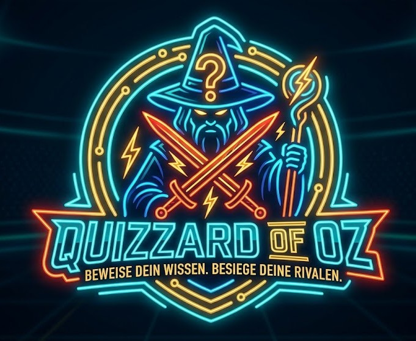

# Quizzard of Oz

<p align="center">
  
</p>

<p align="center"><b>Beweise dein Wissen. Besiege deine Rivalen.</b></p>

<p align="center">
  <a href="https://quizzard-of-oz.readthedocs.io/en/latest/"></a>
  <a href="https://github.com/Gravefax/SQS-Team-11/actions/workflows/ci.yml"></a>
  <a href="https://sonarcloud.io/summary/new_code?id=Gravefax_SQS-Team-11"></a>
  <a href="https://sonarcloud.io/summary/new_code?id=Gravefax_SQS-Team-11"></a>
  <a href="https://sonarcloud.io/summary/new_code?id=Gravefax_SQS-Team-11"></a>
  <a href="https://sonarcloud.io/summary/new_code?id=Gravefax_SQS-Team-11"></a>
  <a href="https://sonarcloud.io/summary/new_code?id=Gravefax_SQS-Team-11"></a>
  <a href="https://sonarcloud.io/summary/new_code?id=Gravefax_SQS-Team-11"></a>
  <a href="https://sonarcloud.io/summary/new_code?id=Gravefax_SQS-Team-11"></a>
  <a href="https://sonarcloud.io/summary/new_code?id=Gravefax_SQS-Team-11"></a>
  <a href="https://sonarcloud.io/summary/new_code?id=Gravefax_SQS-Team-11"></a>
  <a href="https://sonarcloud.io/summary/new_code?id=Gravefax_SQS-Team-11"></a>
  <a href="https://sonarcloud.io/summary/new_code?id=Gravefax_SQS-Team-11"></a>
</p>

**Quizzard of Oz** ist eine Echtzeit-Multiplayer-Quizanwendung, die im Rahmen des Moduls *Software Quality and Security* im Masterstudiengang Informatik an der Technischen Hochschule Rosenheim entwickelt wurde.

Die vollständige Architekturdokumentation ist auf [Read the Docs](https://quizzard-of-oz.readthedocs.io/en/latest/) verfügbar.

## Funktionen

- **1v1-Echtzeit-Battles** — Spieler treten per WebSocket-basiertem Matchmaking gegeneinander an
- **Übungsmodus** — Fragen einzeln beantworten ohne Gegner
- **Rangliste** — Globales Leaderboard mit Punktestand und Siege/Niederlagen-Statistik
- **Fragen-Engine** — Fragen werden automatisch über die [The Trivia API](https://the-trivia-api.com/) geladen und lokal gecacht
- **Authentifizierung** — Sichere Anmeldung über Keycloak (OIDC), Realm wird automatisch beim Start importiert

## Technologien

| Bereich | Stack |
|---|---|
| Frontend | Next.js 16 · React 19 · TypeScript · Tailwind CSS v4 |
| Backend | FastAPI · SQLAlchemy · PostgreSQL 18 |
| Auth | Keycloak 26 |
| Tests | Vitest · Playwright · pytest |
| CI/CD | GitHub Actions · SonarCloud |

## Quickstart

Voraussetzung: [Docker](https://www.docker.com/) und Docker Compose

```bash
git clone https://github.com/Gravefax/SQS-Team-11
cd Quizzard-of-Oz
cp .env.example .env
docker compose up -d
```

Die Anwendung ist danach unter **http://localhost:3000** erreichbar.

## Contributors

<a href="https://github.com/Gravefax/SQS-Team-11/graphs/contributors">
  
</a>

<sub>Made with [contrib.rocks](https://contrib.rocks)</sub>
