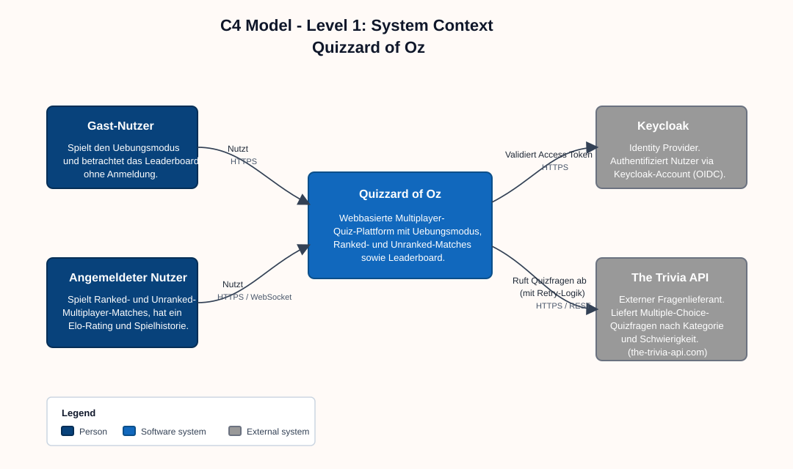

# Architecture

## Introduction and Goals

Quizzard of Oz is a web-based quiz platform for players who want either a
casual solo experience or a competitive multiplayer match with visible
progress. The system exists to combine accessible quiz gameplay, persistent
player identity and synchronized sessions in one product that is simple for
players to use and maintainable for the team to evolve.

### Requirements Overview

The most important functional requirements for the current system are:

1. The platform must support three quiz experiences: practice mode for solo
   play, unranked multiplayer sessions for casual competition and ranked
   multiplayer sessions with Elo updates.
2. Public users must be able to access core product pages such as the
   leaderboard, practice mode, unranked mode and session settings without
   requiring a login.
3. Registered users must have a persistent player identity that connects their
   profile, match history and ranked progression.
4. Ranked and profile-related features must be protected by authentication so
   only authorized users can access them.
5. Multiplayer sessions must stay synchronized across both players, including
   session state, question flow, scoring and round progression.
6. The backend must retrieve quiz questions from an external trivia provider
   and cache them locally to reduce latency and dependency on repeated live API
   calls.

### Quality Goals

| Priority | Quality Goal | Why It Matters | Concrete Expectation |
| --- | --- | --- | --- |
| 1 | Performance | Quiz rounds should feel immediate, especially in ranked and unranked matches where waiting breaks the game flow. | A player should receive the next question or round update without noticeable delay during an active session because the backend uses cached questions and lightweight APIs. |
| 2 | Security | Ranked progression, user profiles and future personal data must be protected from unauthorized access or manipulation. | Only authenticated users can access ranked-only capabilities and credentials are stored as password hashes while session access is controlled through tokens. |
| 3 | Maintainability | The project is developed in a course and team setting, so new contributors must understand and change the system without high onboarding cost. | Frontend, backend, persistence and documentation responsibilities stay clearly separated so a new developer can identify the relevant component quickly. |
| 4 | Reliability | A multiplayer match must behave consistently even when external services are slow or temporarily unavailable. | Running matches should continue without direct dependency on every external trivia request because question data is prepared from local cache whenever possible. |

### Stakeholders

| Role | Expectations | Architectural Interest |
| --- | --- | --- |
| Players | Want responsive quiz gameplay, fair ranked and unranked sessions and a clear user experience across public and authenticated features. | Low latency, reliable session handling, transparent ranking behavior and stable frontend interactions. |
| Development Team | Needs a codebase that is understandable, modular and realistic to extend during the project. | Clear separation of frontend, backend, persistence and external integrations; understandable documentation and interfaces. |
| Reviewers / Instructors | Need to understand the system quickly and evaluate technical decisions, quality and progress. | Traceable requirements, explicit architectural reasoning and documentation that reflects the implemented system. |

## Constraints

### Technical Constraints

| Constraint | Architectural Impact |
| --- | --- |
| The player-facing application is built with Next.js, React and browser-based delivery. | The architecture separates UI state, API access and WebSocket game updates so the frontend can remain responsive while backend services own authentication, matchmaking, scoring and persistence. |
| The backend is implemented in Python with FastAPI. | Backend functionality is exposed through explicit REST and WebSocket interfaces, with Pydantic validation and service-layer code used to keep request handling, business rules and data access understandable. |
| Persistent state is stored in PostgreSQL through SQLAlchemy models. | Users, sessions, rankings and cached questions are modeled relationally so game state and leaderboard data are durable and consistent. This also means schema changes require deliberate modeling and migration discipline. |
| Ranked and unranked multiplayer sessions require near real-time synchronization. | Battle mode uses WebSocket-style communication for session events, which makes connection lifecycle, reconnect handling, event ordering and future horizontal scaling relevant architectural concerns. |
| Quiz questions come from an external Trivia API. | The backend must avoid depending on live upstream calls during every round, so question caching, API timeouts, retries and graceful fallback behavior are part of the core architecture. |
| Authentication uses Google OAuth and backend-managed session cookies. | Login depends on correct OAuth client configuration, token verification and secure cookie handling. Protected routes and E2E tests must account for an external identity provider and application-level session state. |
| Local and deployment workflows use Docker, GitHub Actions, SonarCloud, Sphinx and Read the Docs. | Services and documentation must remain buildable in repeatable environments. Architectural changes should preserve CI checks for backend tests, frontend build and linting, frontend tests, E2E tests, architecture tests and static analysis. |

### Organizational Constraints

| Constraint | Architectural Impact |
| --- | --- |
| The project has no dedicated budget. | The architecture favors open-source frameworks, simple infrastructure, public or educational free tiers and limited managed-service dependency. Costly commercial services are avoided unless they are clearly necessary. |
| The project deadline is June 30, 2026. | Implementation choices should prioritize proven technologies, incremental delivery and scoped features over experimental infrastructure or complex rewrites that would add schedule risk. |
| The development team consists of 3 developers. | Component boundaries must remain easy to understand and maintain. The system avoids unnecessary service decomposition, specialized operational tooling and patterns that require dedicated platform ownership. |
| The system is developed in a course and team setting. | Documentation, traceable decisions and readable interfaces are architectural requirements, not optional extras, because reviewers and new contributors must understand the system quickly. |
| Development is governed by the existing CI and quality process. | Architectural changes must stay testable through the current backend, frontend, E2E, architecture and SonarCloud checks. This encourages modular code and clear contracts between frontend, backend and persistence. |
| Maintenance responsibility remains with the small project team. | The architecture should keep deployment, configuration, observability and troubleshooting straightforward, with a small number of services and explicit environment variables. |

### Legal and Regulatory Requirements

| Requirement or Constraint | Architectural Impact |
| --- | --- |
| The system stores personal or user-related data such as Google subject identifiers, email addresses, usernames, sessions, rankings and match-related state. | Data handling must follow data-protection principles such as purpose limitation, data minimization, storage limitation, integrity and confidentiality. The system should store only data needed for gameplay, authentication and ranking. |
| Authentication and session data must be protected against unauthorized access. | Session cookies should be HttpOnly, secure in production and scoped appropriately. CORS configuration, secret management and protected-route checks must be treated as security-sensitive architecture concerns. |
| Google OAuth integration is subject to Google API and OAuth policies. | The system should request only the user information required for login, verify OAuth tokens on the backend, configure OAuth clients per environment and avoid using Google user data outside the documented authentication purpose. |
| Trivia API usage is subject to the provider's terms, licensing and access limits. | The backend keeps upstream trivia identifiers internal, caches only permitted question content and uses retries, timeouts and cache refill limits to respect provider availability and usage constraints. Commercial use or enhanced provider features would require checking the applicable plan. |
| Open-source dependencies carry licensing obligations. | Frontend and backend dependency choices should remain trackable through package manifests and lock files, and incompatible licenses should be avoided before adding new libraries or deployment components. |
| Logs, storage and access control must avoid unnecessary exposure of sensitive data. | Application logs should not contain OAuth tokens, session identifiers, passwords or unnecessary personal data. Access to ranked mode, profiles and session-backed actions must remain enforced by backend authorization checks. |

## Context and Scope

### Business Context

Quizzard of Oz is used by public players, authenticated players and project
stakeholders. External organizations and services provide identity, question
content, quality checks, documentation hosting and container publication.

| Actor or External Party | Business Interaction |
| --- | --- |
| Guest players | Use public product pages, practice mode, leaderboard views and unranked play without creating a persistent account. |
| Registered players | Sign in with Google, play ranked matches, use persistent profile data and build leaderboard progress through stored rankings and match history. |
| Development team | Builds and maintains the frontend, backend, persistence layer, CI workflows and architecture documentation. |
| Reviewers / instructors | Evaluate whether the product, implementation and documentation meet the course requirements and quality expectations. |
| Google OAuth | Provides the trusted identity used to create or refresh an application session for registered players. |
| Trivia API provider | Supplies external quiz-question content that the backend normalizes and caches for practice and multiplayer gameplay. |
| GitHub, SonarCloud, Read the Docs and GHCR | Support repository collaboration, automated quality checks, published documentation and container image distribution. |

### Technical Context

The system boundary contains the Next.js frontend and FastAPI backend. The
following interfaces connect the system to users, infrastructure and external
services.

| Interface | Protocol / Mechanism | Purpose and Data Exchanged |
| --- | --- | --- |
| Browser to frontend | HTTP/HTTPS | Delivers Next.js pages, JavaScript, styles and static assets for public pages, authentication flows and game screens. |
| Frontend to backend REST APIs | HTTP JSON through `NEXT_PUBLIC_API_BASE` | Exchanges authentication requests, practice questions and answers, trivia batches, user data, rankings and leaderboard search results. |
| Frontend to backend battle queue | WebSocket JSON at `/battle/queue` | Connects authenticated players to matchmaking and sends queue or match assignment events. |
| Frontend to backend battle session | WebSocket JSON at `/battle/ws/{match_id}` | Sends and receives live battle events such as waiting state, category selection, questions, submitted answers, scoring and match results. |
| Google OAuth to backend authentication | Google ID token in `Authorization: Bearer ...` for `/auth/google/login` | Lets the backend verify identity, create or find the local user and issue a backend-managed session cookie. |
| Backend-managed session | HttpOnly cookie named by `SESSION_COOKIE_NAME` | Authenticates refresh, logout, protected HTTP requests and WebSocket handshakes without exposing the session identifier to frontend JavaScript. |
| Backend to PostgreSQL | SQLAlchemy over `psycopg2` / PostgreSQL protocol | Persists users, sessions, rankings, battle-related state and cached trivia questions. |
| Backend to Trivia API | Outbound HTTPS JSON | Retrieves question data from the external provider and stores normalized questions in the local cache with retry, timeout and refill limits. |
| Runtime configuration | Environment variables | Supplies API base URLs, Google OAuth client ID, database credentials, CORS origins, cookie settings and Trivia API settings. |
| CI, documentation and container tooling | GitHub Actions, SonarCloud, Sphinx / Read the Docs and GHCR | Builds and tests the system, publishes documentation, reports quality metrics and publishes frontend/backend container images. |

### Context Diagram

Diagram source: [docs/c4/c1_context.puml](c4/c1_context.puml)

## Solution Strategy

- Use a modern web frontend for the player-facing experience.
- Build the backend around explicit API contracts and cached question access.
- Model sessions and participants directly in the database so gameplay state is
  inspectable and durable.
- Separate concept documentation from architecture decisions to keep this page
  focused on system structure.

## Building Block View

### Whitebox Overall System

**Core building blocks**

- Frontend application for navigation, game flows and player-facing UI
- Backend application for auth, matchmaking, gameplay orchestration and scoring
- Persistence layer for users, sessions, questions and ranking data
- External trivia API used to populate and refresh the question cache

**Important interfaces**

- HTTP APIs between frontend and backend
- WebSocket-style real-time communication for synchronized matches
- Database access for gameplay and leaderboard state
- External API calls for new question data

## Runtime View

### Ranked and Unranked Session Flow

Both synchronized game modes share the same broad sequence:

1. Players enter a queue or session.
2. The backend creates or activates a session.
3. Questions are prepared from cached or newly fetched trivia data.
4. Players answer questions round by round.
5. The backend calculates scores and advances category selection.
6. Ranked mode additionally updates Elo after the match ends.

## Deployment View

### Infrastructure Level 1

- The frontend is deployed as a web application for players.
- The backend is deployed as an API service with access to persistent storage.
- Documentation is deployed separately through Read the Docs using Sphinx.

### Infrastructure Level 2

- Client browsers load the frontend and connect to backend APIs.
- Backend services persist state in the database and communicate with the
  external trivia provider when the cache needs replenishment.

## Cross-cutting Concepts

### Authentication

Authentication is handled with JWT-backed sessions and hashed passwords.

### Real-Time Communication

Ranked and unranked matches need near real-time event delivery so both players
see progress consistently.

### Question Caching

Question data is cached locally to reduce latency and avoid overusing the
external trivia API.

## Quality Requirements

### Quality Requirements Overview

- Responsive question delivery
- Stable synchronized sessions
- Maintainable separation of concerns
- Clear operational and architectural visibility

### Quality Scenarios

- A ranked match should progress without players waiting on repeated external
  question fetches during the session.
- New team members should be able to understand the main system components
  through this documentation alone.

## Risks and Technical Debts

- Real-time synchronization can become fragile if session state is not modeled
  clearly on the backend.
- External trivia API availability may impact gameplay without strong caching.
- Documentation still reflects an evolving product, so some sections remain
  directional rather than final.

## Glossary

| Term | Definition |
| --- | --- |
| Elo | Ranking value used to estimate player skill in ranked matches |
| Session | A single multiplayer match lifecycle |
| Question Cache | Local store of trivia questions fetched from the external provider |
