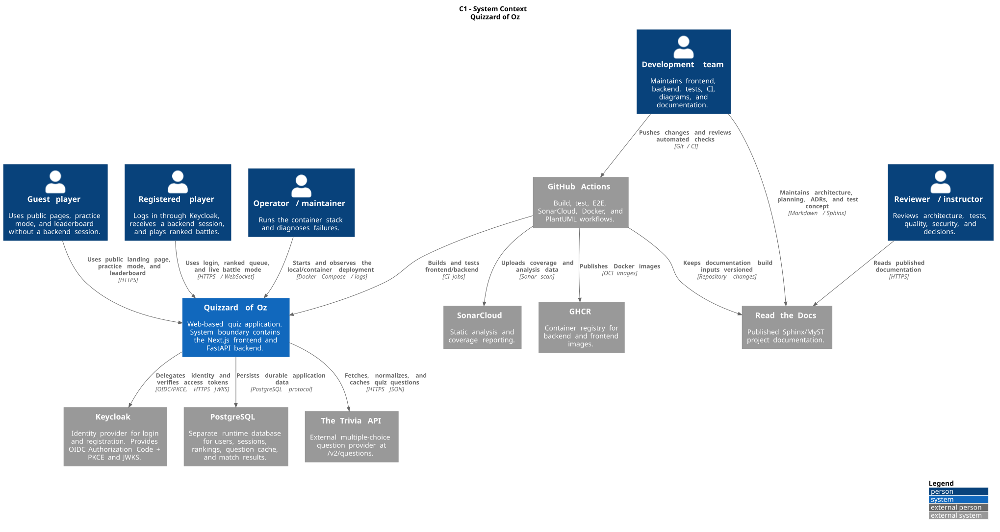
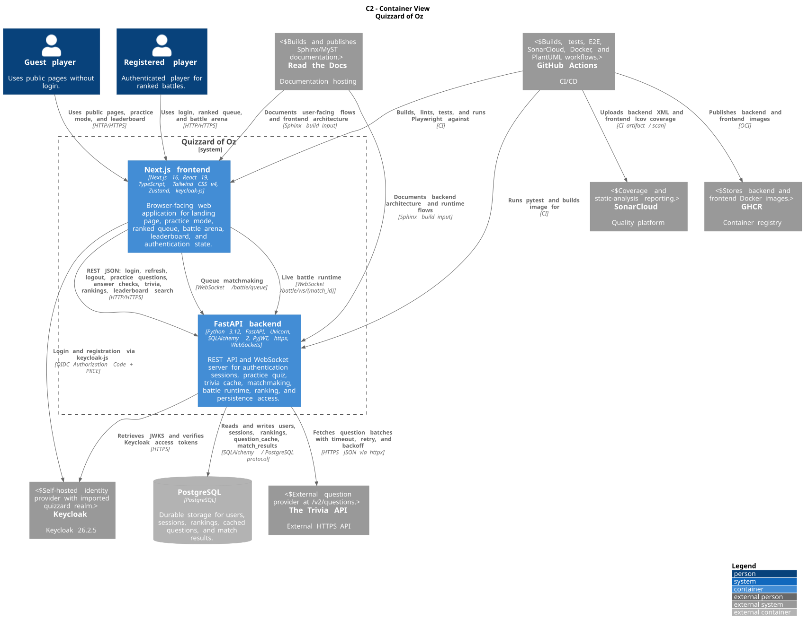
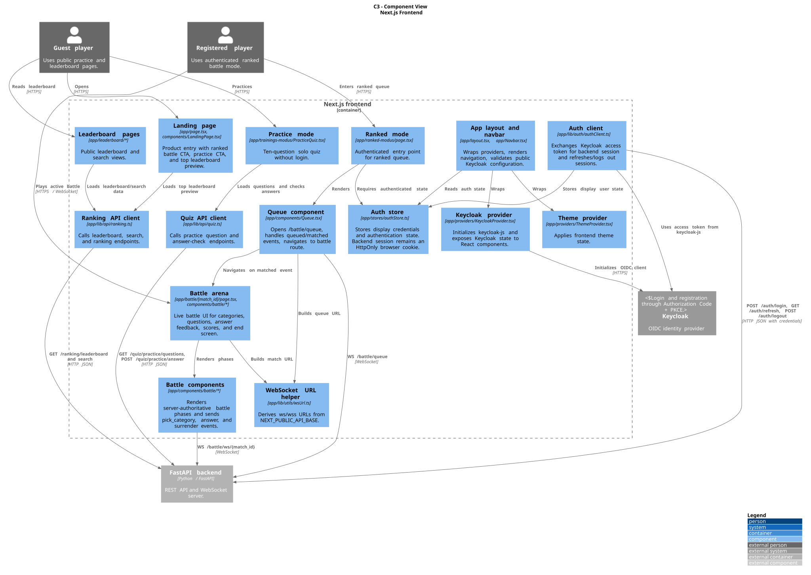
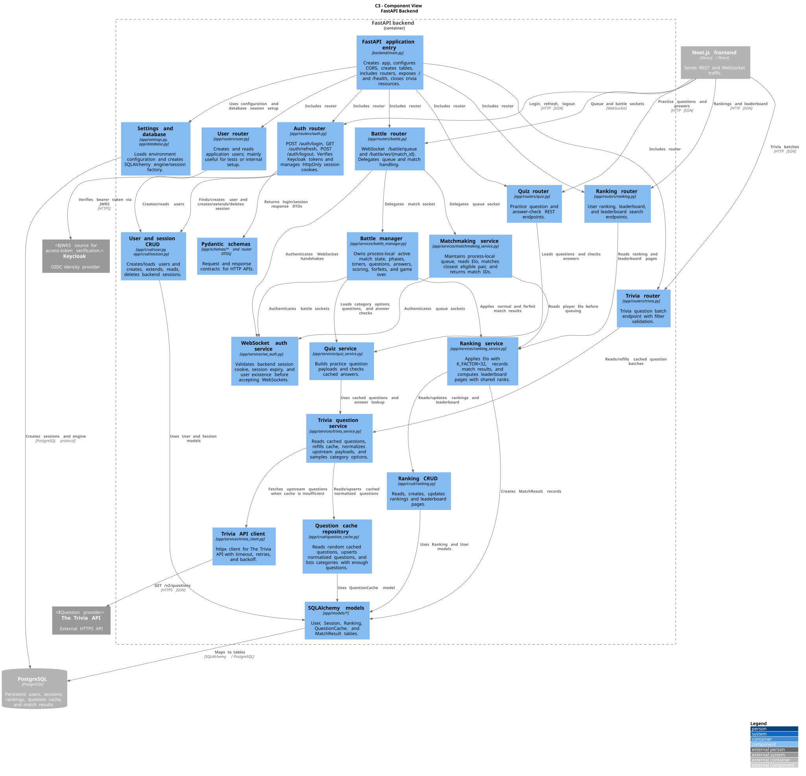
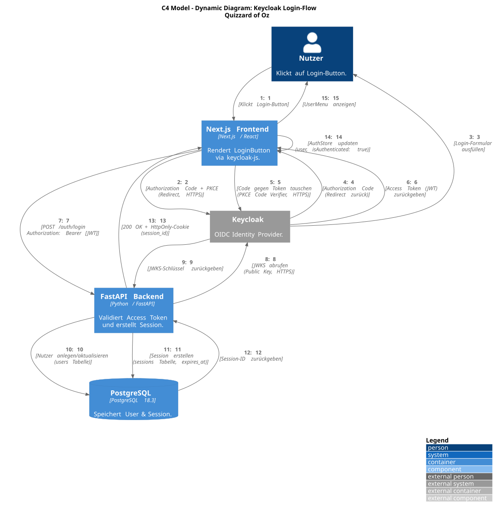
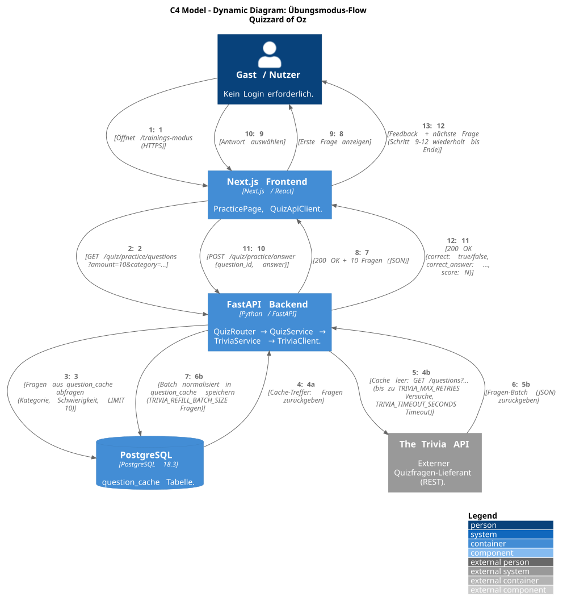
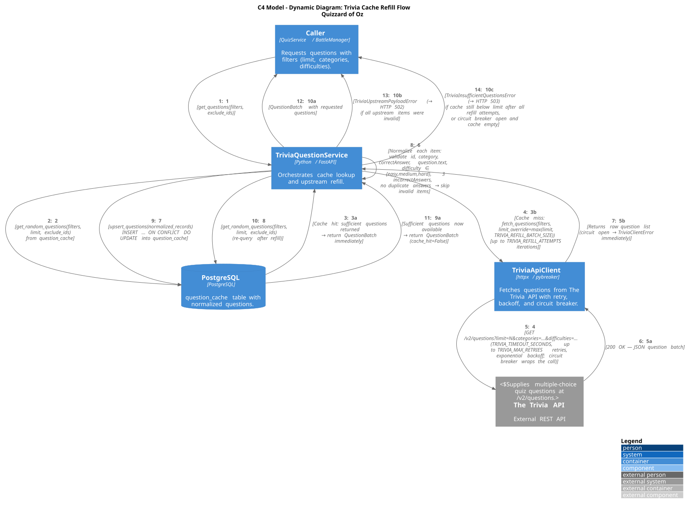
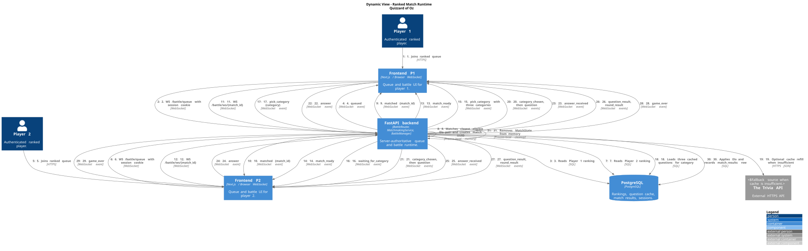
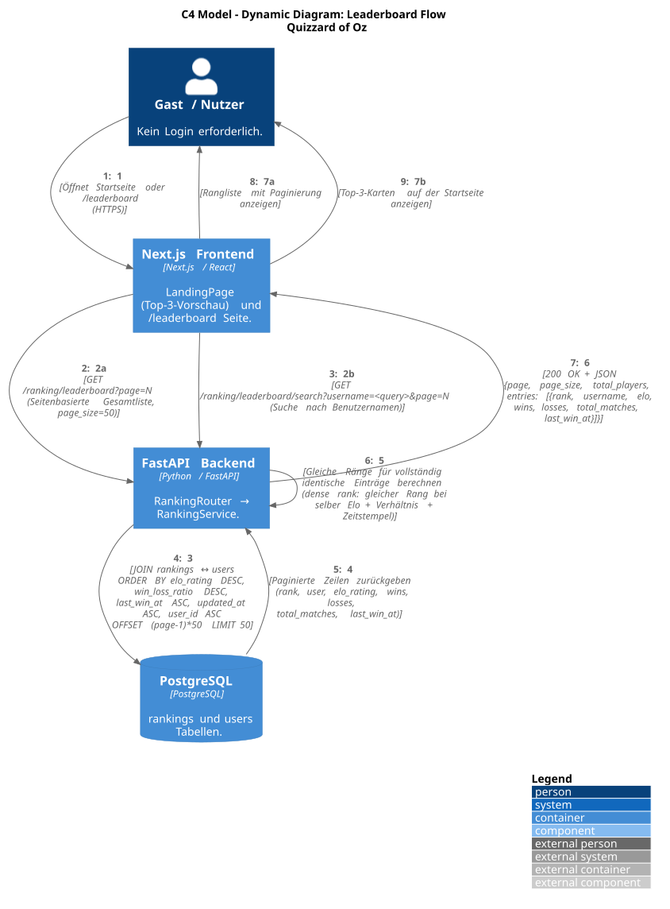

# Architecture

## Introduction and Goals

Quizzard of Oz is a web-based quiz application for solo practice and real-time competitive play. The product combines a Next.js browser frontend, a FastAPI backend, Keycloak-based identity, PostgreSQL persistence, a local trivia-question cache, and WebSocket-driven battle sessions.

The project was developed in the Software Quality and Security module at Technische Hochschule Rosenheim. 

### Requirements Overview

| Requirement | Current Implementation |
| --- | --- |
| Practice quiz | The frontend page `app/trainings-modus` starts a 10-question solo quiz via `GET /quiz/practice/questions` and checks answers via `POST /quiz/practice/answer`. |
| Ranked battle | Authenticated users enter the ranked queue through `app/ranked-modus`. Matchmaking uses WebSocket `/battle/queue`; matches run on `/battle/ws/{match_id}`. |
| Shared battle UI | The `Queue` component supports ranked and unranked labels, but the current landing page exposes ranked battle and practice mode. No separate unranked route is visible in the current frontend. |
| Leaderboard | Public leaderboard and search pages call `/ranking/leaderboard` and `/ranking/leaderboard/search`, using server-side pagination with a page size of 50. |
| Authentication | Browser login uses Keycloak OIDC/PKCE through `keycloak-js`. The backend verifies the Keycloak access token via JWKS and then issues its own HttpOnly session cookie. |
| WebSocket authorization | Queue and battle WebSockets validate the backend session cookie during the handshake before accepting the connection. |
| Ranking | The backend stores one ranking per user, applies Elo updates with `K_FACTOR = 32`, records wins, losses, total matches, last win time, and match history. |
| Question supply | The backend retrieves questions from The Trivia API `/v2/questions`, normalizes valid items, stores them in `question_cache`, and serves later requests from cache when possible. |
| Deployment for local and CI use | Docker Compose starts PostgreSQL, Keycloak, backend, and frontend. GitHub Actions build, test, analyze, and publish container images. |

### Quality Goals

| Priority | Quality Goal | Concrete Scenario |
| --- | --- | --- |
| 1 | Responsive gameplay | During an active battle, both players receive question, answer acknowledgement, reveal, round result, and game-over events without waiting for a live trivia request on every question. |
| 2 | Security | Ranked queue and battle sockets reject clients without a valid backend session cookie. Backend login accepts only Keycloak tokens that can be verified through the realm JWKS. |
| 3 | Maintainability | A developer traces a bug from the API endpoint through the service layer to the database without crossing into unrelated modules, because routing, business logic, and persistence are kept in separate layers. |
| 4 | Reliability | If the external trivia provider is unavailable or returns invalid data, the backend maps the failure to explicit 502/503 responses or aborts the battle with a controlled WebSocket close. |
| 5 | Testability | Backend pytest tests cover auth, ranking, trivia, WebSocket auth, matchmaking, and battle logic. Frontend Vitest, architecture, security, and Playwright tests cover UI flows and boundaries. |

### Stakeholders

| Stakeholder | Expectations | Architectural Interest |
| --- | --- | --- |
| Players | Fast quiz interaction, clear ranking, reliable login, stable battle state. | Low latency, fair scoring, predictable session behavior, useful error states. |
| Development team | Small-team codebase that can be changed safely. | Clear modules, explicit interfaces, repeatable local setup, CI feedback. |
| Reviewers and instructors | Evidence that implementation and documentation reflect course quality and security goals. | Traceable requirements, decision records, risk visibility, test coverage. |
| Operators or maintainers | Simple service startup and diagnosable failures. | Docker Compose, health checks, environment variables, logs, persistence boundaries. |

## Constraints

### Technical Constraints

| Constraint | Architectural Impact |
| --- | --- |
| Frontend uses Next.js 16, React 19, TypeScript, Tailwind CSS v4, Zustand, and `keycloak-js`. | UI behavior is organized around App Router pages, client components, browser WebSockets, and environment-provided public URLs. |
| Backend uses Python 3.12, FastAPI, Uvicorn, SQLAlchemy 2, Pydantic, PyJWT, httpx, and PostgreSQL. | HTTP APIs, WebSocket endpoints, validation, ORM models, and service classes form the backend architecture. |
| Authentication is delegated to Keycloak 26. | The application does not store user passwords. It stores Keycloak subject identifiers and backend sessions. |
| Application sessions are backend-managed. | Login creates a `sessions` row and sets an HttpOnly cookie. Refresh extends the same session. Logout deletes it and clears the cookie. |
| Battle state is held in backend process memory. | Active matches, queue entries, timers, WebSocket connections, round scores, and selected categories are lost on backend restart and cannot be shared across multiple backend replicas without further work. |
| PostgreSQL schema is created through `Base.metadata.create_all(...)` at startup. | No migration tool is visible. Schema changes require extra discipline and are a technical debt item for production use. |
| Trivia questions come from an external provider. | The backend must handle upstream timeouts, retryable status codes, invalid payloads, and cache refill limits. |

### Organizational Constraints

| Constraint | Architectural Impact |
| --- | --- |
| The project is built by a small course team. | The system remains a modular monolith plus frontend rather than many independently deployed services. |
| The project has no dedicated operations budget. | The stack relies on open-source technologies and simple container orchestration. |
| CI and quality gates are part of the project workflow. | Changes should keep pytest, Vitest, Playwright, architecture tests, SonarCloud, and Docker builds working. |
| Documentation is published via Read the Docs. | Markdown must remain compatible with Sphinx/MyST and the existing Furo documentation setup. |

### Legal and Regulatory Constraints

| Constraint | Architectural Impact |
| --- | --- |
| User-related data is stored in PostgreSQL. | The system stores only data needed for login, sessions, rankings, and match history: Keycloak subject, email, username, sessions, rankings, and match results. |
| Session data is security-sensitive. | Cookies must be HttpOnly, appropriately scoped, and secure in production. Logs must avoid tokens, passwords, and session identifiers. |
| Keycloak is self-hosted open-source software. | The realm configuration in `keycloak/realm-export.json` is part of the deployment and test setup. |
| The Trivia API has external terms and availability limits. | Caching and retry settings reduce repeated upstream calls. Commercial or heavier use would require checking the provider plan and terms. |
| Open-source dependencies have license obligations. | Dependency manifests and lock files must remain reviewable before adding libraries. |

## Context and Scope

### Business Context

| Actor or System | Interaction with Quizzard of Oz |
| --- | --- |
| Guest player | Uses public pages such as the landing page, practice mode, and leaderboard without a backend login session. |
| Registered player | Logs in through Keycloak, receives a backend session, enters ranked battle, and appears in rankings after match results. |
| Keycloak | Provides identity through OIDC/PKCE and exposes JWKS for backend token verification. |
| The Trivia API | Supplies multiple-choice questions that the backend normalizes and caches. |
| PostgreSQL | Stores application users, backend sessions, rankings, cached questions, and match result history. |
| GitHub Actions | Runs build, test, E2E, architecture, SonarCloud, Docker, and diagram-generation workflows. |
| SonarCloud | Receives backend and frontend coverage reports and reports quality metrics. |
| Read the Docs | Builds and publishes Sphinx documentation. |
| GHCR | Receives backend and frontend Docker images from the Docker workflow. |

### Technical Context

| Interface | Mechanism | Data Exchanged |
| --- | --- | --- |
| Browser to frontend | HTTP/HTTPS | Next.js pages, JavaScript, CSS, static assets, manifest, favicon. |
| Frontend to backend REST | HTTP JSON through `NEXT_PUBLIC_API_BASE`; local Next.js rewrites can proxy `/api/*` to the backend. | Login, refresh, logout, practice questions, answer checks, trivia batches, rankings, leaderboard search. |
| Frontend to backend queue | WebSocket `/battle/queue` | Session-cookie-authenticated matchmaking. Messages include `queued` and `matched`. |
| Frontend to backend match | WebSocket `/battle/ws/{match_id}` | Live match protocol: category picking, questions, answer submission, answer acknowledgement, `question_result`, round results, surrender, forfeit, and game over. |
| Frontend to Keycloak | OIDC Authorization Code + PKCE via `keycloak-js` | Login, registration, access token acquisition, logout redirect. |
| Backend to Keycloak | HTTPS JWKS lookup | Public keys for verifying Keycloak access tokens. |
| Backend to PostgreSQL | SQLAlchemy over PostgreSQL protocol | CRUD for users, sessions, rankings, cached questions, and match results. |
| Backend to The Trivia API | HTTPS JSON via httpx | `/v2/questions` requests with limit, categories, difficulties, optional API key, timeout, retries, backoff, and a circuit breaker for sustained outages. |
| Configuration | Environment variables and Docker build args | Database credentials, CORS origins, session cookie settings, Keycloak URL/realm/client ID, Trivia API settings, API base URL, build commit. |

### System Boundary

Quizzard of Oz contains the Next.js frontend and FastAPI backend. PostgreSQL and Keycloak are part of the local/container deployment but remain separate runtime services. The Trivia API, GitHub Actions, SonarCloud, GHCR, and Read the Docs are external supporting systems.

PlantUML sources live in `docs/c4` and are the authoritative diagram definitions. Generated SVGs live in `docs/images` and are regenerated by the `plantuml.yml` workflow. If a rendered SVG lags behind a PlantUML source change, treat the source file and the prose in this document as authoritative.

### System Context Diagram

Purpose: show the users, the Quizzard of Oz system boundary, and external runtime/supporting systems.

Main elements: guest player, registered player, development team, reviewers, operators, Quizzard of Oz, Keycloak, PostgreSQL, The Trivia API, GitHub Actions, SonarCloud, GHCR, and Read the Docs.

Source: `docs/c4/c1_context.puml`

The context view makes identity delegation, external question supply, persistent storage, and CI/documentation infrastructure explicit. Quizzard of Oz contains the Next.js frontend and FastAPI backend; PostgreSQL and Keycloak are shown as separate runtime services.

## Solution Strategy

- Keep the product as a small modular web system: one Next.js frontend, one FastAPI backend, one PostgreSQL database, and one Keycloak identity service.
- Use REST APIs for request/response interactions such as login, refresh, practice questions, answers, rankings, and leaderboard search.
- Use WebSockets for battle queue and match runtime events because both players need low-latency, bidirectional state updates.
- Delegate identity to Keycloak and keep application sessions in PostgreSQL-backed HttpOnly cookies so frontend JavaScript does not need direct access to the backend session identifier.
- Keep battle orchestration in `BattleManager` and matchmaking in `MatchmakingService`; both are process-local and protected with asyncio locks for concurrent WebSocket actions.
- Cache normalized trivia questions in PostgreSQL to decouple most gameplay from live upstream calls and reduce latency/rate-limit pressure.
- Use SQLAlchemy models and CRUD repositories for persistent data access; use service classes for game, trivia, ranking, and auth-related behavior.
- Keep quality feedback automated through backend pytest, frontend Vitest, architecture tests, security tests, Playwright E2E tests, SonarCloud, and Docker workflows.

## Building Block View

### Level 1 — Whitebox Overall System

| Building Block | Responsibility | Main Technologies |
| --- | --- | --- |
| Next.js frontend | Player UI, route handling, Keycloak client initialization, auth state, theme state, REST clients, WebSocket clients, battle rendering. | Next.js, React, TypeScript, Zustand, keycloak-js, Axios, Tailwind CSS. |
| FastAPI backend | REST API, WebSocket server, auth/session handling, matchmaking, battle state machine, ranking, trivia integration, persistence access. | FastAPI, Uvicorn, SQLAlchemy, Pydantic, PyJWT, httpx, websockets. |
| PostgreSQL database | Persistent data for users, sessions, rankings, question cache, and match result history. | PostgreSQL 18 in Docker Compose, PostgreSQL 16 in CI E2E service. |
| Keycloak | Identity provider and realm configuration for login/registration. | Keycloak 26.2.5, imported `quizzard` realm. |
| Trivia provider | External question source. | The Trivia API `/v2/questions`. |

Source: `docs/c4/c2_container.puml`

Purpose: show the deployable/executable units and their runtime communication.

Main elements: Next.js frontend and FastAPI backend inside the Quizzard of Oz boundary; PostgreSQL and Keycloak as separate runtime services; The Trivia API and supporting CI/documentation systems as external systems.

The container view separates public browser delivery, REST JSON calls, queue WebSockets, battle WebSockets, OIDC/PKCE login, JWKS token verification, SQLAlchemy/PostgreSQL persistence, and outbound Trivia API access.

### Frontend Building Blocks

| Block | Implementation | Responsibility |
| --- | --- | --- |
| App layout | `app/layout.tsx`, `Navbar`, providers | Wraps the app in theme and Keycloak providers, renders navigation, validates required Keycloak public config. |
| Landing page | `app/page.tsx`, `components/LandingPage.tsx` | Shows product entry, ranked battle CTA, practice CTA, and top 3 leaderboard preview. |
| Practice mode | `app/trainings-modus/PracticeQuiz.tsx`, `app/lib/api/quiz.ts` | Loads 10 practice questions and submits answer checks to the backend. |
| Ranked mode | `app/ranked-modus/page.tsx`, `components/Queue.tsx` | Gates ranked queue by frontend auth state and opens WebSocket `/battle/queue`. |
| Battle arena | `app/battle/[match_id]/page.tsx`, `components/battle/*` | Connects to `/battle/ws/{match_id}` and renders battle phases. |
| Auth client | `app/lib/auth/authClient.ts`, `providers/KeycloakProvider.tsx`, `stores/authStore.ts` | Initializes Keycloak, exchanges Keycloak token for backend session, refreshes/logout sessions, stores display credential. |
| Ranking client | `app/lib/api/ranking.ts` | Loads leaderboard and username search results. |
| Architecture tests | `app/__tests__/arch/architecture.test.ts` | Enforces no circular dependencies, no component imports from API routes, and no production imports from test files. |

Source: `docs/c4/c3_frontend_components.puml`

### Backend Building Blocks

| Block | Implementation | Responsibility |
| --- | --- | --- |
| Application entry | `backend/main.py` | Creates the FastAPI app, configures CORS, creates DB tables, includes routers, exposes `/` and `/health`, closes trivia client resources on shutdown. |
| Settings | `app/settings.py`, `app/database.py` | Loads CORS and Trivia settings with Pydantic, loads DB environment variables, creates SQLAlchemy engine/session factory. |
| Auth router | `app/routers/auth.py` | Verifies Keycloak bearer tokens, creates users, creates/extends/deletes backend sessions, sets and clears session cookies. Reaches persistence only through `user_service`/`session_service`, never directly through CRUD. |
| WebSocket auth | `app/services/ws_auth.py` | Validates session cookie, session expiry, and user existence before accepting queue or battle sockets. |
| User/session services | `app/services/user_service.py`, `app/services/session_service.py` | Thin service wrappers over user and session CRUD so routers honour the enforced `routers > services > crud` layering (issue #94). |
| User router | `app/routers/user.py` | Creates and reads users through `user_service`. Current create path uses username as `keycloak_sub`, so it is mainly useful for tests or internal setup. |
| Quiz router/service | `app/routers/quiz.py`, `app/services/quiz_service.py` | Serves practice questions and checks practice answers through the trivia service. |
| Trivia router/service/client | `app/routers/trivia.py`, `app/services/trivia_service.py`, `app/services/trivia_client.py` | Parses filters, fetches/cache-refills questions, validates payloads, exposes cached internal question IDs to clients. The client guards upstream calls with timeout, retry/backoff, and a `pybreaker` circuit breaker (ADR 11). |
| Battle router | `app/routers/battle.py` | Exposes queue and battle WebSocket endpoints and delegates to matchmaking/battle services. |
| Matchmaking service | `app/services/matchmaking_service.py` | Maintains in-memory queue, reads player Elo, matches closest eligible pair, expands allowed Elo delta over wait time, returns a match ID. |
| Battle manager | `app/services/battle_manager.py` | Holds in-memory match state, enforces phases, handles category selection, questions, timers, scoring, surrender, disconnect, forfeit, game over. |
| Ranking service | `app/services/ranking_service.py` | Applies Elo updates, records match results, computes leaderboard pages and shared ranks on ties. |
| CRUD/models | `app/crud/*`, `app/models/*` | Encapsulate SQLAlchemy access to persistent tables. |

Source: `docs/c4/c3_backend_components.puml`

Purpose: decompose the FastAPI backend into routers, services, persistence adapters, models, schemas, and external adapters.

Selected container: FastAPI backend.

Main elements: `main.py`, settings/database, auth/user/quiz/trivia/ranking/battle routers, WebSocket auth, quiz/trivia/matchmaking/battle/ranking services, CRUD repositories, SQLAlchemy models, Pydantic schemas, PostgreSQL, Keycloak, and The Trivia API.

The backend component view highlights the intended layering: routers own inbound protocol handling, services own business rules, CRUD repositories encapsulate database access, models define persistent tables, and external adapters isolate Keycloak and Trivia API communication. This layering (`routers > services > crud > models`) is enforced by import-linter contracts in `backend/.importlinter`: routers must reach persistence only through services, and CRUD stays a leaf that imports neither routers nor services (issue #94). See the test concept for the contract details.

### Code/Class View: Battle Runtime

Purpose: show the architecturally significant code-level structure around `BattleManager`, because ranked battles combine authentication, process-local state, WebSockets, timers, question loading, scoring, forfeit handling, and ranking updates.

Selected component: `BattleManager` and the ranked battle runtime.

Main elements: `BattleRouter`, `WsAuthService`, `MatchmakingService`, `QueueEntry`, `BattleManager`, `MatchState`, player entries stored in `MatchState.players`, `QuizService`, `TriviaQuestionService`, `QuestionCacheRepository`, `RankingService`, ranking/session/user CRUD modules, and the persistent `User`, `Session`, `Ranking`, `QuestionCache`, and `MatchResult` models.

Source: `docs/c4/c4_battle_runtime_code.puml`

Important implementation notes visible in the code-level view:

- Active queue and battle state is process-local backend memory.
- `MatchState` is the central runtime state object and protects state mutations with an `asyncio.Lock`.
- The current code does not define a separate `PlayerState` class; connected players are stored as dictionaries in `MatchState.players`.
- The repository does not currently contain a dedicated `MatchResultRepository`; `RankingService.apply_match_result` persists `MatchResult` through SQLAlchemy while updating rankings.
- Persistent state is limited to users, sessions, rankings, cached questions, and match results in PostgreSQL.

### Persistent Data Model

| Table | Purpose | Important Fields |
| --- | --- | --- |
| `users` | Local application user linked to Keycloak identity. | `id`, `keycloak_sub`, `email`, `username`, `created_at`. |
| `sessions` | Backend-managed application sessions. | `id`, `user_id`, `expires_at`, `created_at`. |
| `rankings` | One ranking row per user. | `user_id`, `elo_rating`, `wins`, `losses`, `total_matches`, `last_win_at`, `updated_at`. |
| `question_cache` | Normalized local copy of Trivia API questions. | `external_id`, `question_text`, `answers`, `correct_answer`, `category`, `difficulty`, `cached_at`. |
| `match_results` | Match history entry for ranking outcomes. | `winner_id`, `loser_id`, `ended_as` (`normal` or `forfeit`), `created_at`. |

Active queue entries and active battle state are not stored in PostgreSQL. They live in memory inside `MatchmakingService` and `BattleManager`.

## Runtime View

### Runtime Overview Diagram

This flow diagram summarizes the ranked battle lifecycle. The detailed runtime descriptions below are authoritative for the currently implemented WebSocket event names and persistence behavior.

### Login and Session Flow

Source: `docs/c4/c4_dynamic_login.puml`

1. The user clicks the login button in the frontend.
2. `keycloak-js` runs the Keycloak Authorization Code + PKCE flow.
3. The frontend receives a Keycloak access token.
4. The frontend calls `POST /auth/login` with `Authorization: Bearer <token>`.
5. The backend verifies the token through Keycloak JWKS and reads the `sub` claim.
6. The backend finds or creates a `users` row using `keycloak_sub`.
7. The backend creates a `sessions` row with `expires_at`.
8. The backend returns username/email/expiry and sets the configured HttpOnly session cookie.
9. The frontend stores display credentials in Zustand; the session cookie remains browser-managed.

Refresh uses `GET /auth/refresh`, validates the existing cookie, extends expiry, and returns the same response shape. Logout uses `POST /auth/logout`, deletes the session if present, and clears the cookie.

### Practice Quiz Flow

Source: `docs/c4/c4_dynamic_practice.puml`

1. `PracticeQuiz` calls `GET /quiz/practice/questions`.
2. `QuizService` requests 10 questions from `TriviaQuestionService`.
3. The trivia service tries to serve matching cached questions first.
4. If cache is insufficient, `TriviaApiClient` fetches `/v2/questions`, retries configured transient failures, and the service normalizes valid items.
5. Normalized questions are upserted into `question_cache`.
6. The frontend receives question IDs, text, answers, and categories, but not `correct_answer`.
7. For each answer, the frontend calls `POST /quiz/practice/answer`.
8. The backend compares the answer with the cached correct answer and returns correctness plus correct answer.

### Trivia Cache Refill Flow

Source: `docs/c4/c4_dynamic_trivia_refill.puml`

1. The REST trivia endpoint accepts `limit`, `categories`, and `difficulties`.
2. Unsupported query parameters, repeated `limit`, invalid limits, unsupported difficulties, and `query` are rejected with 400.
3. The cache repository returns random matching questions, excluding IDs where required by battle flows.
4. On cache miss, the client fetches from The Trivia API with configured timeout, retry count, backoff, and batch size. A circuit breaker wraps the call: after `TRIVIA_BREAKER_FAIL_MAX` consecutive failed fetches it opens and short-circuits further upstream calls, failing fast until `TRIVIA_BREAKER_RESET_TIMEOUT` elapses and it half-opens (closing again on the next success).
5. Invalid upstream payload items are skipped; if all items are invalid, the backend raises a payload error. Non-retryable responses and payload errors do not count toward the breaker, since they are not upstream outages.
6. If the cache still cannot satisfy the requested limit after refill attempts — or while the breaker is open and the cache is empty — the backend returns 503 for HTTP callers or aborts an active battle setup, now without paying the per-request timeout and retry budget. See ADR 11.

### Authenticated Ranked Battle from Queue to Game Over

Scenario: two registered players enter ranked matchmaking, are matched by Elo, play a best-of-five battle, and persist the result.

Trigger: an authenticated player opens the ranked mode and the frontend opens WebSocket `/battle/queue`.

Preconditions:

- Both players have completed Keycloak login.
- The backend has verified each Keycloak access token via JWKS.
- Each browser has a backend-managed HttpOnly session cookie.
- PostgreSQL is reachable for session, ranking, question cache, and match result persistence.

Participants:

- Registered players and their browser frontends.
- Next.js ranked page, `Queue`, and battle arena.
- FastAPI `BattleRouter`.
- `WsAuthService`, `MatchmakingService`, `BattleManager`, `QuizService`, `TriviaQuestionService`, and `RankingService`.
- PostgreSQL for sessions, rankings, question cache, and match results.
- The Trivia API when cache refill is required.

Source: `docs/c4/c4_dynamic_match.puml`

Sequence diagram source: `docs/c4/runtime_ranked_battle.puml`

Step-by-step flow:

1. Player 1 opens WebSocket `/battle/queue`; the backend validates the session cookie before accepting the socket.
2. `MatchmakingService` reads the player's ranking, queues the socket with Elo, queue time, and sequence number, and sends `queued` if no eligible opponent exists.
3. Player 2 opens `/battle/queue`; the backend validates the session cookie and reads the player's ranking.
4. Matching prefers the closest Elo pair. The initial allowed Elo delta is 75 and grows by 50 every 5 seconds.
5. Both players receive `matched` with the same match UUID.
6. Both clients navigate to `/battle/{match_id}` and open `/battle/ws/{match_id}`.
7. The backend validates each session cookie again before accepting the battle socket.
8. The first connected player receives `waiting_for_opponent`.
9. When the second player connects, `BattleManager` creates or updates `MatchState`, sends `match_ready` to both players, and randomly chooses the first category picker.
10. At each round, the picker receives `pick_category` with three categories and a 30-second category deadline; the other player receives `waiting_for_category`.
11. The picker sends `pick_category`; the backend ignores invalid picker, wrong-phase, or invalid-category messages and keeps server-authoritative state.
12. The backend loads three questions for the selected category from cache, refilling from The Trivia API if necessary, and tracks used question IDs.
13. Both clients receive `category_chosen`, then each `question`.
14. The server starts a 20-second answer deadline for each question.
15. Each player sends `answer`; the backend records the answer and replies only to that player with `answer_received`.
16. The backend hides the correct answer until both players answer or the timer expires.
17. Both players receive `question_result` with correctness, correct answer, their submitted answer, and reveal duration.
18. After three questions, both players receive `round_result`.
19. The first player to win 3 rounds wins the best-of-five battle.
20. Both players receive `game_over`.
21. `RankingService.apply_match_result` updates Elo, wins, losses, totals, and inserts a `match_results` row.
22. `BattleManager` removes the in-memory `MatchState`.

Alternative and error flows:

- Missing, invalid, not-found session or missing user: WebSocket close 4001.
- Expired session: WebSocket close 4003.
- Invalid category picker, wrong phase, or invalid category: backend ignores/rejects the event and keeps authoritative server state.
- Trivia upstream payload invalid: controlled upstream payload error.
- Insufficient questions or upstream unavailable: HTTP callers receive 503; battle question preparation closes battle sockets with 1011 and a generic reason.
- Surrender or disconnect during `picking` or `questions`: remaining player receives `opponent_forfeit`, rankings update, `match_results.ended_as = "forfeit"`, and in-memory match state is removed.
- Disconnect before match start: does not count as a forfeit.
- Backend restart: active queue entries and active matches are lost because both are process-local memory.

Security considerations:

- Keycloak owns identity; the backend owns application sessions.
- WebSocket handshakes validate the backend session cookie.
- The session cookie must be HttpOnly. Production cookies should also be Secure and scoped to the correct domain/SameSite policy.
- Logs must avoid tokens, passwords, and session identifiers.

Consistency and state considerations:

- Active battle state is protected by per-match `asyncio.Lock` instances.
- Matchmaking queue state is protected by its own service lock.
- Ranking and match result updates are persisted after normal game over or forfeit.
- Completed match results and ranking updates are written to PostgreSQL; active matches are lost on backend restart.

Performance considerations:

- WebSockets avoid polling for battle queue and runtime communication.
- Cached questions avoid live upstream calls for every battle question.
- Batch refill, category sampling, and random cache selection reduce latency and external API pressure.

### Leaderboard Flow

Source: `docs/c4/c4_dynamic_leaderboard.puml`

1. The landing page and leaderboard page call `/ranking/leaderboard?page=N`.
2. Search calls `/ranking/leaderboard/search?username=<query>&page=N`.
3. The backend joins rankings to users, orders by Elo, win/loss ratio, last win time, update time, and user ID.
4. Fully tied leaderboard entries share the same rank.
5. The response contains `page`, `page_size`, `total_players`, and entries with rank, user, Elo, wins, losses, total matches, and last win time.

### Diagram Traceability

| Trace | Mapping |
| --- | --- |
| C1 to C2 | The Quizzard of Oz system from C1 is refined into the Next.js frontend and FastAPI backend containers. Keycloak, PostgreSQL, The Trivia API, GitHub Actions, SonarCloud, GHCR, and Read the Docs remain outside the application boundary. |
| C2 to C3 | The FastAPI backend container is refined into routers, services, CRUD repositories, models, schemas, and external adapters. The frontend container is refined separately into pages, providers, stores, clients, and battle components. |
| C3 to C4 | The backend battle components are refined into `BattleRouter`, `WsAuthService`, `MatchmakingService`, `BattleManager`, `MatchState`, trivia/ranking services, CRUD modules, and persistent models. |
| Runtime view | The ranked battle runtime uses the C1 registered player, C2 frontend/backend/PostgreSQL/Keycloak/Trivia API, C3 battle/auth/trivia/ranking components, and C4 `BattleManager`/`MatchState` code-level elements. |

## Deployment View

### Local Docker Compose Deployment

| Service | Image or Build | Ports | Health / Dependency |
| --- | --- | --- | --- |
| `postgres` | `postgres:18.3-trixie` | `${POSTGRES_PORT:-5432}:5432` | `pg_isready`; backend waits for healthy DB. |
| `keycloak` | `quay.io/keycloak/keycloak:26.2.5` | `8080:8080` | TCP health check; backend waits for healthy Keycloak. Imports `keycloak/realm-export.json`. |
| `backend` | Built from `backend/Dockerfile` | `8000:8000` | `/health`; depends on PostgreSQL and Keycloak. |
| `frontend` | Built from `frontend/quizzard-of-oz/Dockerfile` | `3000:3000` | Depends on healthy backend. |

The backend image runs as a non-root `appuser`. The frontend image uses a multi-stage Next.js standalone build and runs as a non-root `nextjs` user with read-only application files after build.

### Configuration

| Area | Variables |
| --- | --- |
| Database | `POSTGRES_DB`, `POSTGRES_USER`, `POSTGRES_PASSWORD`, `POSTGRES_PORT`, `POSTGRES_HOST`, `ECHO_DATABASE`. |
| Session cookie | `SESSION_EXP_MINUTES`, `COOKIE_SECURE`, `COOKIE_SAMESITE`, `COOKIE_DOMAIN`, `SESSION_COOKIE_NAME`. |
| Keycloak | Backend: `KEYCLOAK_URL`, `KEYCLOAK_REALM`; frontend: `NEXT_PUBLIC_KEYCLOAK_URL`, `NEXT_PUBLIC_KEYCLOAK_REALM`, `NEXT_PUBLIC_KEYCLOAK_CLIENT_ID`. |
| Frontend/backend routing | `BACKEND_URL`, `NEXT_PUBLIC_API_BASE`. |
| Trivia API | `TRIVIA_API_BASE_URL`, `TRIVIA_API_KEY`, `TRIVIA_TIMEOUT_SECONDS`, `TRIVIA_MAX_RETRIES`, `TRIVIA_BACKOFF_SECONDS`, `TRIVIA_REFILL_ATTEMPTS`, `TRIVIA_REFILL_BATCH_SIZE`, `TRIVIA_MAX_LIMIT`. |
| Build metadata | `GIT_COMMIT` for frontend and backend Docker builds. |

### CI/CD and Documentation Infrastructure

| Workflow | Responsibility |
| --- | --- |
| `ci.yml` frontend build | Installs pnpm dependencies on Node 22 and runs `pnpm build`. |
| `ci.yml` backend tests | Installs Python 3.12 dependencies, runs `lint-imports` architecture contracts, and runs pytest with branch coverage and XML output. |
| `ci.yml` frontend tests | Runs linting, Vitest coverage, and architecture tests. |
| `ci.yml` E2E tests | Starts PostgreSQL service and Keycloak container, then runs Playwright with frontend and backend web servers. |
| `ci.yml` SonarCloud | Downloads coverage artifacts and runs SonarCloud analysis. |
| `docker.yml` | Builds and pushes backend/frontend images to GHCR for changes on `main` and `dev`. |
| `plantuml.yml` | Regenerates PlantUML SVG diagrams for `docs/c4/*.puml`. |
| Read the Docs | Builds Sphinx documentation from `docs/conf.py` using Python 3.13 and `docs/requirements.txt`. |

## Cross-cutting Concepts

### Authentication and Sessions

Keycloak owns identity. The backend owns application sessions. The frontend sends the Keycloak access token only to `POST /auth/login`; after that, session continuity relies on the backend session cookie. HTTP APIs that need the session use browser credentials, and WebSocket handshakes validate the same cookie.

Important session properties are environment-controlled: cookie name, SameSite mode, Secure flag, domain, and expiry. Production deployments should set `COOKIE_SECURE=true` and a domain appropriate to the deployed frontend/backend origin.

### Authorization Boundaries

Ranked queue and battle WebSockets require an authenticated backend session. The ranked page also checks frontend auth state and shows a login card when missing. Public features include the landing page, practice mode, and leaderboard. Backend ranking endpoints are currently public.

### Real-Time Communication

The battle protocol is server-authoritative. The client sends only category picks, answers, and surrender. The backend owns phase transitions, timers, scoring, round wins, game-over conditions, forfeit handling, and ranking updates.

### State Management

Persistent state is stored in PostgreSQL. Transient battle state is held in memory as `MatchState` objects. `asyncio.Lock` protects state mutations inside each match, and the matchmaking queue has its own lock.

### Ranking

Ranking uses Elo with `K_FACTOR = 32`. A normal match and a forfeit both update winner and loser ratings, wins/losses, and total matches. Forfeits are distinguished in `match_results.ended_as`.

### Question Caching

The backend stores normalized question content in `question_cache` and exposes internal cached UUIDs to clients. Upstream question IDs remain internal as `external_id`. The service filters by category and difficulty, samples random cache entries, avoids reused question IDs during one match, and refills cache batches when needed.

### Error Handling

Trivia failures are mapped to explicit HTTP errors: invalid client filters return 400, invalid upstream payloads return 502, upstream unavailability or insufficient questions return 503. Battle question-preparation failures close sockets with internal close code 1011 and a generic reason.

### Logging

Backend logging is configured in `main.py` with timestamped log formatting for uvicorn loggers. Battle and trivia services log operational events without intentionally logging tokens, passwords, or session identifiers.

### Frontend Boundaries

Frontend architecture tests enforce:

- no circular dependencies in `app/`
- no imports from `app/api` routes directly into `app/components`
- no production source imports from test files

### Testing Strategy

Backend tests cover routers, CRUD, services, settings, authentication, WebSocket auth, matchmaking, ranking, battle state, and trivia integration. Backend architecture tests enforce the `routers > services > crud > models` layering with import-linter, driven from `tests/test_architecture.py` and run as a `lint-imports` step in CI. Frontend tests cover unit, integration, security, architecture, and E2E scenarios. Playwright E2E runs sequentially because shared backend state, fixed test accounts, and WebSocket queues can create cross-test interference.

## Architecture Decisions

Detailed ADRs are documented in [Architecture Decisions](decisions.md). The most important accepted decisions are:

| ADR | Decision | Architectural Effect |
| --- | --- | --- |
| ADR 1 | Use Next.js for the frontend. | App Router pages and React components form the UI architecture. |
| ADR 2 | Use Python with FastAPI for backend services. | REST and WebSocket interfaces are implemented in one ASGI backend. |
| ADR 3 | Use pnpm for frontend dependency management. | Frontend CI and Docker builds rely on pnpm lockfile reproducibility. |
| ADR 4 | Use a relational database, specifically PostgreSQL. | Users, sessions, rankings, cache, and match results are relational tables. |
| ADR 5 | Use SQLAlchemy ORM with Pydantic schemas. | Data access is encapsulated in models/CRUD while HTTP contracts use typed schemas. |
| ADR 6 | Use WebSockets instead of polling for game communication. | Battle queue and match runtime use bidirectional WebSocket channels. |
| ADR 7 | Initial Google login. | Historical decision that was superseded because it made E2E automation and custom registration harder. |
| ADR 8 | Use Keycloak instead of Google OAuth. | Local/testable login, self-hosted realm import, and backend JWKS verification are part of the architecture. |
| ADR 9 | Use backend-managed HttpOnly sessions. | Application authorization relies on PostgreSQL-backed sessions and browser-managed cookies. |
| ADR 10 | Keep active matchmaking and battle state process-local. | Current runtime state is simple and fast, but backend restarts and horizontal scaling require mitigation. |
| ADR 11 | Wrap external Trivia API calls in a circuit breaker. | Sustained upstream outages fail fast (503 / aborted battle setup) instead of paying the per-request timeout and retry budget. |

## Quality Requirements

### Quality Scenarios

| Quality | Scenario | Current Mechanism |
| --- | --- | --- |
| Performance | A battle round should not wait on a live upstream trivia call for every question. | Cached questions, category options from cache, batch refill, random cache selection. |
| Security | A user without a valid session tries to join the queue. | WebSocket auth closes with 4001 for missing/invalid/not-found sessions and 4003 for expired sessions. |
| Security | A forged Keycloak token is sent to `/auth/login`. | PyJWT/JWKS verification raises an error and the endpoint returns 401. |
| Reliability | One player closes the browser during an active battle. | Backend records a forfeit win for the remaining player and cleans up match state. |
| Reliability | The Trivia API returns malformed payload items. | Invalid items are skipped; all-invalid payloads become a controlled upstream payload error. |
| Maintainability | A developer changes battle UI behavior. | Battle phase UI is split into `components/battle/phases`, while server rules stay in `BattleManager`. |
| Testability | A frontend component accidentally imports an API route. | Dependency-cruiser architecture test fails. |
| Testability | A backend router imports `app.crud` directly instead of going through a service. | import-linter `routers-no-direct-crud` contract fails in `lint-imports` and `tests/test_architecture.py`. |
| Operability | Docker Compose starts services locally. | PostgreSQL, Keycloak, and backend health checks order startup before frontend availability. |

### Acceptance Checks

- Backend tests: `python -m pytest tests -q` from `backend/`.
- Backend architecture contracts: `lint-imports` from `backend/`.
- Frontend lint: `pnpm lint` from `frontend/quizzard-of-oz`.
- Frontend coverage: `pnpm test:coverage` from `frontend/quizzard-of-oz`.
- Frontend architecture tests: `pnpm test:arch` from `frontend/quizzard-of-oz`.
- E2E tests: `pnpm test:e2e` with PostgreSQL, Keycloak, backend, and frontend available.
- Documentation build: `python -m sphinx -b html docs docs/_build/html`.

## Risks and Technical Debts

| Risk or Debt | Impact | Possible Mitigation |
| --- | --- | --- |
| In-memory queue and battle state | Backend restart drops active matches; multiple backend replicas cannot share matches. | Persist match state or introduce shared state/pub-sub before horizontal scaling. |
| No migration tooling | Schema changes rely on `Base.metadata.create_all` and manual coordination. | Introduce Alembic migrations and document schema rollout. |
| Production deployment unspecified | TLS, secrets, backups, log aggregation, and scaling are open. | Add deployment architecture, environment profiles, and operational runbook. |
| Trivia API dependency | Cache misses can fail if upstream is unavailable, invalid, or rate-limited. | Pre-warm cache, monitor upstream errors, define fallback behavior. |
| Documentation drift | Planning docs and generated C4 diagrams contain some planned or older details. | Treat `docs/architecture.md` as current source of truth and regenerate/update diagrams after architecture changes. |
| Cookie/CORS configuration sensitivity | Wrong domain, SameSite, Secure, or CORS settings can break login or weaken security. | Add environment-specific examples and deployment checks. |
| Limited observability | Logs exist, but no metrics/tracing stack is visible. | Add structured metrics for queue length, active matches, upstream failures, and WebSocket close codes. |
| User-created route ambiguity | `/users/` can create users with `keycloak_sub=username`, which does not match normal Keycloak login semantics. | Restrict, remove, or document the endpoint if it is only for tests/admin setup. |
| Frontend WebSocket env mismatch | README mentions `NEXT_PUBLIC_WS_BASE`, but `wsUrl.ts` derives from `NEXT_PUBLIC_API_BASE`. | Align README/config or implement explicit `NEXT_PUBLIC_WS_BASE` support. |

## Glossary

| Term | Definition |
| --- | --- |
| Battle | A real-time two-player quiz match run through backend WebSockets. |
| Battle Arena | Frontend screen for an active match at `/battle/{match_id}`. |
| CORS | Cross-Origin Resource Sharing rules configured in FastAPI to allow browser calls from configured frontend origins. |
| Elo | Rating algorithm used to estimate player strength and update rankings after matches. |
| Forfeit | Match ending caused by surrender or active-match disconnect; persisted as `ended_as = "forfeit"`. |
| HttpOnly Cookie | Browser cookie inaccessible to JavaScript; used for backend application sessions. |
| JWKS | JSON Web Key Set served by Keycloak and used by the backend to verify token signatures. |
| Keycloak Realm | Isolated Keycloak configuration namespace. This project imports the `quizzard` realm. |
| Match ID | UUID generated by matchmaking and used by both players to connect to the same battle WebSocket path. |
| Match Result | Persistent record of winner, loser, end reason, and timestamp in `match_results`. |
| OIDC/PKCE | OpenID Connect Authorization Code flow with Proof Key for Code Exchange, used by the browser login flow. |
| Question Cache | PostgreSQL table containing normalized questions fetched from The Trivia API. |
| Queue | In-memory matchmaking list maintained by `MatchmakingService`. |
| Ranking | Persistent per-user Elo and win/loss statistics stored in `rankings`. |
| Session | Backend-managed login record in `sessions`, referenced by the session cookie. |
| The Trivia API | External provider used by the backend to fetch quiz questions from `/v2/questions`. |
| WebSocket Close Code 4001 | Custom close code for unauthorized or invalid WebSocket sessions. |
| WebSocket Close Code 4003 | Custom close code for expired WebSocket sessions. |
