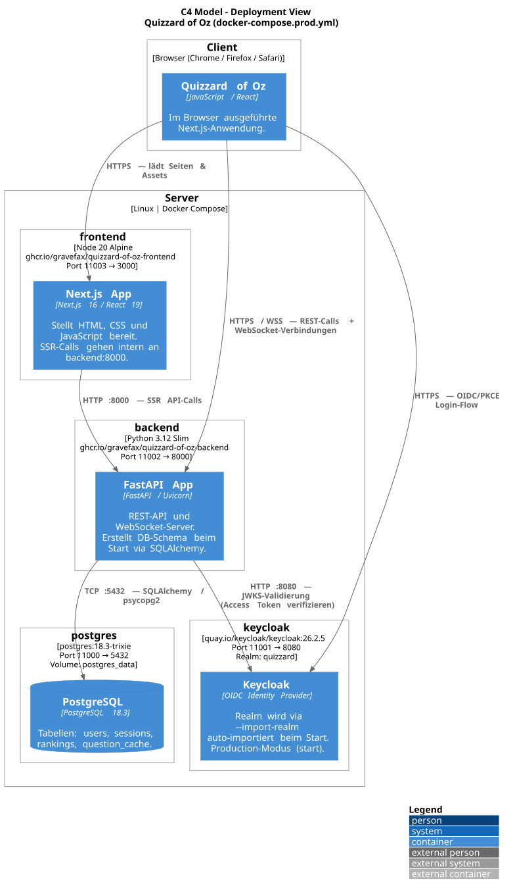

# Architecture

## Introduction and Goals

Quizzard of Oz is a web-based quiz platform for players who want either a
casual solo experience or a competitive multiplayer match with visible
progress. The system exists to combine accessible quiz gameplay, persistent
player identity and synchronized sessions in one product that is simple for
players to use and maintainable for the team to evolve.

### Requirements Overview

The most important functional requirements for the current system are:

1. The platform must support three quiz experiences: practice mode for solo
   play, unranked multiplayer sessions for casual competition and ranked
   multiplayer sessions with Elo updates.
2. Public users must be able to access core product pages such as the
   leaderboard, practice mode, unranked mode and session settings without
   requiring a login.
3. Registered users must have a persistent player identity that connects their
   profile, match history and ranked progression.
4. Ranked and profile-related features must be protected by authentication so
   only authorized users can access them.
5. Multiplayer sessions must stay synchronized across both players, including
   session state, question flow, scoring and round progression.
6. The backend must retrieve quiz questions from an external trivia provider
   and cache them locally to reduce latency and dependency on repeated live API
   calls.

### Quality Goals

| Priority | Quality Goal | Why It Matters | Concrete Expectation |
| --- | --- | --- | --- |
| 1 | Performance | Quiz rounds should feel immediate, especially in ranked and unranked matches where waiting breaks the game flow. | A player should receive the next question or round update without noticeable delay during an active session because the backend uses cached questions and lightweight APIs. |
| 2 | Security | Ranked progression, user profiles and future personal data must be protected from unauthorized access or manipulation. | Only authenticated users can access ranked-only capabilities and credentials are stored as password hashes while session access is controlled through tokens. |
| 3 | Maintainability | The project is developed in a course and team setting, so new contributors must understand and change the system without high onboarding cost. | Frontend, backend, persistence and documentation responsibilities stay clearly separated so a new developer can identify the relevant component quickly. |
| 4 | Reliability | A multiplayer match must behave consistently even when external services are slow or temporarily unavailable. | Running matches should continue without direct dependency on every external trivia request because question data is prepared from local cache whenever possible. |

### Stakeholders

| Role | Expectations | Architectural Interest |
| --- | --- | --- |
| Players | Want responsive quiz gameplay, fair ranked and unranked sessions and a clear user experience across public and authenticated features. | Low latency, reliable session handling, transparent ranking behavior and stable frontend interactions. |
| Development Team | Needs a codebase that is understandable, modular and realistic to extend during the project. | Clear separation of frontend, backend, persistence and external integrations; understandable documentation and interfaces. |
| Reviewers / Instructors | Need to understand the system quickly and evaluate technical decisions, quality and progress. | Traceable requirements, explicit architectural reasoning and documentation that reflects the implemented system. |

## Constraints

### Technical Constraints

| Constraint | Architectural Impact |
| --- | --- |
| The player-facing application is built with Next.js, React and browser-based delivery. | The architecture separates UI state, API access and WebSocket game updates so the frontend can remain responsive while backend services own authentication, matchmaking, scoring and persistence. |
| The backend is implemented in Python with FastAPI. | Backend functionality is exposed through explicit REST and WebSocket interfaces, with Pydantic validation and service-layer code used to keep request handling, business rules and data access understandable. |
| Persistent state is stored in PostgreSQL through SQLAlchemy models. | Users, sessions, rankings and cached questions are modeled relationally so game state and leaderboard data are durable and consistent. This also means schema changes require deliberate modeling and migration discipline. |
| Ranked and unranked multiplayer sessions require near real-time synchronization. | Battle mode uses WebSocket-style communication for session events, which makes connection lifecycle, reconnect handling, event ordering and future horizontal scaling relevant architectural concerns. |
| Quiz questions come from an external Trivia API. | The backend must avoid depending on live upstream calls during every round, so question caching, API timeouts, retries and graceful fallback behavior are part of the core architecture. |
| Authentication uses Keycloak (OIDC/PKCE) and backend-managed session cookies. | Login depends on correct Keycloak realm configuration, JWT verification via JWKS and secure cookie handling. Protected routes and E2E tests must account for the identity provider and application-level session state. |
| Local and deployment workflows use Docker, GitHub Actions, SonarCloud, Sphinx and Read the Docs. | Services and documentation must remain buildable in repeatable environments. Architectural changes should preserve CI checks for backend tests, frontend build and linting, frontend tests, E2E tests, architecture tests and static analysis. |

### Organizational Constraints

| Constraint | Architectural Impact |
| --- | --- |
| The project has no dedicated budget. | The architecture favors open-source frameworks, simple infrastructure, public or educational free tiers and limited managed-service dependency. Costly commercial services are avoided unless they are clearly necessary. |
| The project deadline is June 30, 2026. | Implementation choices should prioritize proven technologies, incremental delivery and scoped features over experimental infrastructure or complex rewrites that would add schedule risk. |
| The development team consists of 3 developers. | Component boundaries must remain easy to understand and maintain. The system avoids unnecessary service decomposition, specialized operational tooling and patterns that require dedicated platform ownership. |
| The system is developed in a course and team setting. | Documentation, traceable decisions and readable interfaces are architectural requirements, not optional extras, because reviewers and new contributors must understand the system quickly. |
| Development is governed by the existing CI and quality process. | Architectural changes must stay testable through the current backend, frontend, E2E, architecture and SonarCloud checks. This encourages modular code and clear contracts between frontend, backend and persistence. |
| Maintenance responsibility remains with the small project team. | The architecture should keep deployment, configuration, observability and troubleshooting straightforward, with a small number of services and explicit environment variables. |

### Legal and Regulatory Requirements

| Requirement or Constraint | Architectural Impact |
| --- | --- |
| The system stores personal or user-related data such as Keycloak subject identifiers, email addresses, usernames, sessions, rankings and match-related state. | Data handling must follow data-protection principles such as purpose limitation, data minimization, storage limitation, integrity and confidentiality. The system should store only data needed for gameplay, authentication and ranking. |
| Authentication and session data must be protected against unauthorized access. | Session cookies should be HttpOnly, secure in production and scoped appropriately. CORS configuration, secret management and protected-route checks must be treated as security-sensitive architecture concerns. |
| Keycloak is self-hosted and subject to its open-source license and operational responsibilities. | The system should request only the user information required for login, verify access tokens on the backend via JWKS, configure the Keycloak realm per environment and avoid storing unnecessary identity data outside the documented authentication purpose. |
| Trivia API usage is subject to the provider's terms, licensing and access limits. | The backend keeps upstream trivia identifiers internal, caches only permitted question content and uses retries, timeouts and cache refill limits to respect provider availability and usage constraints. Commercial use or enhanced provider features would require checking the applicable plan. |
| Open-source dependencies carry licensing obligations. | Frontend and backend dependency choices should remain trackable through package manifests and lock files, and incompatible licenses should be avoided before adding new libraries or deployment components. |
| Logs, storage and access control must avoid unnecessary exposure of sensitive data. | Application logs should not contain OAuth tokens, session identifiers, passwords or unnecessary personal data. Access to ranked mode, profiles and session-backed actions must remain enforced by backend authorization checks. |

## Context and Scope

### Business Context

Quizzard of Oz is used by public players, authenticated players and project
stakeholders. External organizations and services provide identity, question
content, quality checks, documentation hosting and container publication.

| Actor or External Party | Business Interaction |
| --- | --- |
| Guest players | Use public product pages, practice mode, leaderboard views and unranked play without creating a persistent account. |
| Registered players | Sign in via Keycloak, play ranked matches, use persistent profile data and build leaderboard progress through stored rankings and match history. |
| Development team | Builds and maintains the frontend, backend, persistence layer, CI workflows and architecture documentation. |
| Reviewers / instructors | Evaluate whether the product, implementation and documentation meet the course requirements and quality expectations. |
| Keycloak | Provides the trusted identity used to create or refresh an application session for registered players. |
| Trivia API provider | Supplies external quiz-question content that the backend normalizes and caches for practice and multiplayer gameplay. |
| GitHub, SonarCloud, Read the Docs and GHCR | Support repository collaboration, automated quality checks, published documentation and container image distribution. |

### Technical Context

The system boundary contains the Next.js frontend and FastAPI backend. The
following interfaces connect the system to users, infrastructure and external
services.

| Interface | Protocol / Mechanism | Purpose and Data Exchanged |
| --- | --- | --- |
| Browser to frontend | HTTP/HTTPS | Delivers Next.js pages, JavaScript, styles and static assets for public pages, authentication flows and game screens. |
| Frontend to backend REST APIs | HTTP JSON through `NEXT_PUBLIC_API_BASE` | Exchanges authentication requests, practice questions and answers, trivia batches, user data, rankings and leaderboard search results. |
| Frontend to backend battle queue | WebSocket JSON at `/battle/queue` | Connects authenticated players to matchmaking and sends queue or match assignment events. |
| Frontend to backend battle session | WebSocket JSON at `/battle/ws/{match_id}` | Sends and receives live battle events such as waiting state, category selection, questions, submitted answers, scoring and match results. |
| Keycloak to backend authentication | Keycloak access token in `Authorization: Bearer ...` for `POST /auth/login` | Lets the backend verify identity via JWKS, create or find the local user and issue a backend-managed session cookie. |
| Backend-managed session | HttpOnly cookie named by `SESSION_COOKIE_NAME` | Authenticates refresh, logout, protected HTTP requests and WebSocket handshakes without exposing the session identifier to frontend JavaScript. |
| Backend to PostgreSQL | SQLAlchemy over `psycopg2` / PostgreSQL protocol | Persists users, sessions, rankings, battle-related state and cached trivia questions. |
| Backend to Trivia API | Outbound HTTPS JSON | Retrieves question data from the external provider and stores normalized questions in the local cache with retry, timeout and refill limits. |
| Runtime configuration | Environment variables | Supplies API base URLs, Keycloak URL/realm/client ID, database credentials, CORS origins, cookie settings and Trivia API settings. |
| CI, documentation and container tooling | GitHub Actions, SonarCloud, Sphinx / Read the Docs and GHCR | Builds and tests the system, publishes documentation, reports quality metrics and publishes frontend/backend container images. |

### Context Diagram

Diagram source: [docs/c4/c1_context.puml](c4/c1_context.puml)

## Solution Strategy

The table below maps each quality goal to the primary architectural decision
that addresses it.

| Quality Goal | Architectural Decision | Concrete Mechanism |
| --- | --- | --- |
| Performance | Cache trivia questions locally in PostgreSQL | TriviaService refills the cache in configurable batches; active match rounds and practice mode read exclusively from `question_cache`, never from the live Trivia API. |
| Security | Keycloak OIDC/PKCE + backend-managed session cookies | The frontend exchanges an authorization code for a short-lived access token and passes it to the backend once via `POST /auth/login`. The backend issues an HttpOnly session cookie for all subsequent requests so JWTs are never stored in browser-accessible storage. |
| Maintainability | Strict three-layer backend architecture with enforced import rules | Routers delegate to Services, Services call CRUD functions. Cross-layer imports in the wrong direction are detected and blocked by architecture tests (`pytest-arch`) on every pull request. |
| Maintainability | Separation of concerns across independent containers | Frontend owns rendering and user interaction; backend owns game logic, scoring and data; PostgreSQL owns persistence. Each container is independently deployable and replaceable. |
| Reliability | Graceful degradation on external API failure | TriviaClient retries failed requests with configurable backoff. If the Trivia API remains unavailable the backend serves questions from cache or returns a structured error — it does not crash the running match. |
| Reliability | Self-hosted Keycloak with automated realm import | Keycloak runs as a Docker container; the `quizzard` realm is imported on every startup from a committed JSON file, so the identity provider recovers automatically after a restart without manual configuration. |

## Building Block View

### Level 1 — Whitebox Overall System

**Core building blocks**

- Frontend application for navigation, game flows and player-facing UI
- Backend application for auth, matchmaking, gameplay orchestration and scoring
- Persistence layer for users, sessions, questions and ranking data
- External trivia API used to populate and refresh the question cache

**Important interfaces**

- HTTP REST APIs between frontend and backend
- WebSocket real-time communication for synchronized matches
- Database access for gameplay and leaderboard state
- Outbound HTTP calls for new question data from the Trivia API

### Level 2 — Container View

Diagram source: [docs/c4/c2_container.puml](c4/c2_container.puml)

| Container | Technology | Responsibility |
| --- | --- | --- |
| Next.js Frontend | Next.js 16, React 19, Tailwind CSS, Zustand, keycloak-js | Renders all player-facing pages, manages local UI state and auth context, communicates with the backend via REST and WebSocket. |
| FastAPI Backend | Python 3.12, FastAPI, Uvicorn, SQLAlchemy 2.0, httpx | Exposes REST endpoints and WebSocket handlers for all game modes; owns all business logic, matchmaking, Elo calculation and session management. |
| PostgreSQL | PostgreSQL 18.3-trixie | Persists users, backend sessions, Elo rankings and the cached trivia question pool across four tables: `users`, `sessions`, `rankings`, `question_cache`. |
| Keycloak | Keycloak 26.2.5, OIDC/PKCE | Self-hosted identity provider. The realm `quizzard` is auto-imported via `--import-realm` on every container start. Issues access tokens the backend validates via JWKS. |

### Level 3 — Backend Components

Diagram source: [docs/c4/c3_backend_components.puml](c4/c3_backend_components.puml)

The backend follows a strict three-layer architecture. Architecture tests
enforced by `pytest-arch` prevent imports across layers in the wrong
direction.

| Layer | Components | Rule |
| --- | --- | --- |
| Routers | AuthRouter, QuizRouter, BattleRouter, RankingRouter, TriviaRouter | Accept HTTP/WebSocket requests, validate parameters with Pydantic and delegate to services. Must not contain business logic. |
| Services | BattleManagerService, MatchmakingService, RankingService, QuizService, TriviaService, TriviaClient | Contain all business logic and orchestration. May call other services or CRUD functions. Must not import routers. |
| CRUD | UserCRUD, SessionCRUD, RankingCRUD, QuestionCacheCRUD | Encapsulate all SQLAlchemy queries. Only layer that accesses the database directly. |

Key service responsibilities:

- **BattleManagerService** — owns the match state machine (`waiting → picking → questions → finished`), coordinates question loading per round and triggers Elo updates after a match ends.
- **MatchmakingService** — manages the queue for ranked and unranked modes; assigns matches based on Elo proximity and notifies both clients via the queue WebSocket.
- **TriviaService / TriviaClient** — manages the question cache lifecycle; TriviaClient fetches from the Trivia API with retry and backoff; TriviaService decides when to refill and how many questions to request.
- **RankingService** — calculates Elo deltas using K-factor 32 and provides paginated leaderboard queries.

### Level 3 — Frontend Components

Diagram source: [docs/c4/c3_frontend_components.puml](c4/c3_frontend_components.puml)

| Category | Components | Responsibility |
| --- | --- | --- |
| Pages | LandingPage, PracticePage, RankedPage, LeaderboardPage, BattleArenaPage | Next.js file-based routes. Each page composes components and initiates data fetching. Must not be imported by components. |
| Components | LoginButton, UserMenu, Queue, BattleComponents (CategoryPicker, QuestionCard, AnswerFeedback, ScoreBoard) | Reusable React components. May read from stores or call API clients. Must not import Pages. |
| API Clients | AuthClient, QuizApiClient, RankingApiClient, WebSocketClient | Typed wrappers for all backend communication. Isolate HTTP and WebSocket transport details from UI code. |
| State | AuthStore (Zustand) | Global authentication state. Stores user identity and session status after a successful login. |
| Provider | KeycloakProvider | Initializes `keycloak-js` and exposes the Keycloak instance via React context to all components that need auth. |

Architecture tests enforced by `dependency-cruiser` prevent Pages from being
imported by Components, keeping the component hierarchy unidirectional.

## Runtime View

### Login Flow

Diagram source: [docs/c4/c4_dynamic_login.puml](c4/c4_dynamic_login.puml)

The login sequence follows the Authorization Code with PKCE flow:

1. The user clicks the login button; `keycloak-js` starts a PKCE flow and redirects the browser to Keycloak.
2. The user submits credentials on Keycloak's login form.
3. Keycloak redirects back to the frontend with an authorization code.
4. The frontend exchanges the code for an access token (JWT) using the PKCE code verifier.
5. The frontend sends `POST /auth/login` with `Authorization: Bearer <JWT>`.
6. The backend fetches Keycloak's JWKS public keys and verifies the token signature and claims.
7. The backend creates or updates the local user record in `users` and creates a new session row in `sessions`.
8. The backend responds with HTTP 200 and sets an HttpOnly session cookie (`SESSION_COOKIE_NAME`).
9. The frontend updates AuthStore with the user profile and renders the authenticated UI.

### Practice Mode Flow

Diagram source: [docs/c4/c4_dynamic_practice.puml](c4/c4_dynamic_practice.puml)

Practice mode is available to all visitors without login:

1. The player opens `/trainings-modus`.
2. The frontend requests `GET /quiz/practice/questions` with optional category and difficulty parameters.
3. QuizService reads up to the requested number of questions from `question_cache` for the given filter.
4. If the cache has fewer questions than requested, TriviaService calls TriviaClient to fetch a fresh batch from the Trivia API (configurable retries and timeout via `TRIVIA_MAX_RETRIES` and `TRIVIA_TIMEOUT_SECONDS`). The fetched questions are normalized and stored in `question_cache`.
5. The backend returns the question list; the frontend displays questions one at a time.
6. After each selection the frontend posts `POST /quiz/practice/answer` with the chosen answer.
7. The backend validates the answer and returns `{correct, correct_answer, score}`.
8. Steps 6–7 repeat until all questions are answered.

### Ranked and Unranked Session Flow

Both synchronized game modes share the same broad sequence:

1. Players enter a queue or session.
2. The backend creates or activates a session.
3. Questions are prepared from cached or newly fetched trivia data.
4. Players answer questions round by round.
5. The backend calculates scores and advances category selection.
6. Ranked mode additionally updates Elo after the match ends.

### Multiplayer Match Flow (Detailed)

Diagram source: [docs/c4/c4_dynamic_match.puml](c4/c4_dynamic_match.puml)

The multiplayer flow consists of four phases:

**Phase 1 — Matchmaking:** Both players connect to `WS /battle/queue` and
send `type: queued`. MatchmakingService checks the Elo range and, when a
suitable opponent is found, assigns both players a shared `match_id` and
sends `type: matched` to each.

**Phase 2 — Match connection:** Both players open a second WebSocket to
`WS /battle/ws/{match_id}`. The backend validates the session cookie on
connection. Once both clients are connected, each receives `type:
match_ready` with the opponent's username.

**Phase 3 — Round loop** (repeated until one player wins 3 rounds): The
active player receives `pick_category` with three choices, selects one and
the backend broadcasts the choice. BattleManagerService reads three
questions for that category from `question_cache` and sends `type:
question` to both. Each player submits `type: answer` independently; the
backend immediately responds with `type: answer_result` showing whether
the answer was correct and the current score. After both players have
answered all three questions the backend sends `type: round_result` with
the round winner and cumulative scores.

**Phase 4 — Match end:** The backend sends `type: game_over` with the
overall winner and, for ranked matches, the Elo delta for each player.
RankingService updates both players' Elo ratings (K-factor 32) in the
`rankings` table.

## Deployment View

### Infrastructure Level 1

- The frontend is deployed as a containerized Next.js application reachable via HTTPS.
- The backend is deployed as a containerized FastAPI application with direct access to PostgreSQL and Keycloak.
- Keycloak is deployed as a self-hosted container; the `quizzard` realm is auto-imported from `keycloak/realm-export.json` on every startup.
- Documentation is deployed separately through Read the Docs using Sphinx.

### Infrastructure Level 2 — Docker Compose Services

Diagram source: [docs/c4/c4_deployment.puml](c4/c4_deployment.puml)

All runtime services are defined in `docker-compose.yml` (local development)
and `docker-compose.prod.yml` (production). The table below reflects the
production configuration:

| Service | Image | External Port | Depends On | Notes |
| --- | --- | --- | --- | --- |
| `postgres` | `postgres:18.3-trixie` | 11000 → 5432 | — | Persistent volume `postgres_data`; health-checked before backend starts. |
| `keycloak` | `quay.io/keycloak/keycloak:26.2.5` | 11001 → 8080 | `postgres` (healthy) | Production mode (`start --import-realm`); realm auto-configured on startup. |
| `backend` | `ghcr.io/gravefax/quizzard-of-oz-backend` | 11002 → 8000 | `postgres` (healthy), `keycloak` (healthy) | Uvicorn ASGI; creates all DB tables at startup via `Base.metadata.create_all()`. |
| `frontend` | `ghcr.io/gravefax/quizzard-of-oz-frontend` | 11003 → 3000 | `backend` (healthy) | Multi-stage build; `NEXT_PUBLIC_*` values baked into the image at build time. |

All sensitive values (database credentials, Keycloak admin password, API
secrets, cookie settings and Trivia API keys) are supplied through environment
variables defined in a `.env` file that is not committed to the repository. An
`.env.example` template documents all required variables.

### CI/CD Pipeline

The project uses GitHub Actions for all automated quality and deployment steps.
Workflow files are located in `.github/workflows/`.

| Stage | Workflow | Trigger | Steps |
| --- | --- | --- | --- |
| Backend tests | `ci.yml` | Push / PR to `dev` or `main` | `pytest` with coverage, `ruff` lint, `mypy` strict type check, `pytest-arch` layer rules |
| Frontend tests | `ci.yml` | Push / PR to `dev` or `main` | ESLint, `vitest` unit tests, Playwright E2E tests, `dependency-cruiser` architecture rules |
| SonarCloud analysis | `ci.yml` | Push / PR | Aggregates coverage reports from backend and frontend; enforces quality gate |
| Docker build & push | `docker.yml` | Push to `main` (backend or frontend path changed) | Builds images and pushes to `ghcr.io/gravefax/quizzard-of-oz-{backend,frontend}` |
| PlantUML render | `plantuml.yml` | PR to `dev` with changes in `docs/c4/` | Renders all `.puml` files in `docs/c4/` to SVG and commits the result to `docs/images/` |
| Docs publish | Read the Docs webhook | Merge to `main` | Read the Docs rebuilds and publishes the Sphinx documentation automatically |

## Cross-cutting Concepts

### Domain Model

The system's four persistent entities and their relationships:

| Entity | Table | Key Attributes | Relationships |
| --- | --- | --- | --- |
| User | `users` | `id`, `keycloak_sub` (unique), `username`, `email` | Has one Ranking; has many Sessions |
| Session | `sessions` | `id`, `user_id` (FK), `expires_at` | Belongs to one User |
| Ranking | `rankings` | `user_id` (FK, unique), `elo` (default 1000), `wins`, `losses` | Belongs to one User |
| QuestionCache | `question_cache` | `id`, `category`, `difficulty`, `question`, `correct_answer`, `incorrect_answers` (JSON) | No user reference; shared across all game modes |

A `User` is created on first login from the Keycloak `sub` claim. A `Ranking`
row is created alongside the user with a starting Elo of 1000. `Session` rows
expire at `expires_at`; the frontend uses `GET /auth/refresh` to extend them.
`QuestionCache` rows have no expiry; they persist until replaced by a fresh
batch from TriviaService.

### Authentication and Session Management

Authentication follows the Keycloak OIDC/PKCE flow (see [Login Flow](#login-flow)):

- The frontend uses `keycloak-js` for the browser-side PKCE exchange and token retrieval.
- The backend verifies the resulting JWT via Keycloak's JWKS endpoint using `PyJWT` and `PyJWKClient`.
- After verification the backend issues a backend-managed HttpOnly session cookie (`SESSION_COOKIE_NAME`). The cookie is `Secure` and `SameSite` in production (values driven by `COOKIE_SECURE` and `COOKIE_SAMESITE` environment variables).
- All protected REST endpoints read the session cookie and validate it against the `sessions` table before processing the request.
- WebSocket handshakes for `/battle/queue` and `/battle/ws/{match_id}` also validate the session cookie; invalid or expired sessions cause an immediate close with code 1008.
- The frontend stores user metadata in AuthStore (Zustand) for UI rendering; it does not store the session cookie or any token in JavaScript-accessible storage.

### Real-Time Communication

Ranked and unranked matches use two WebSocket endpoints managed by BattleRouter:

- `/battle/queue` — the matchmaking channel. A player sends `type: queued` after connecting; MatchmakingService assigns a match and sends `type: matched` with a `match_id` when a suitable opponent is found.
- `/battle/ws/{match_id}` — the per-match channel used for the full game lifecycle. All game events (`match_ready`, `pick_category`, `category_chosen`, `question`, `answer`, `answer_result`, `round_result`, `game_over`) are exchanged as JSON objects with a `type` field on this channel.

The backend closes connections cleanly with an appropriate close code when a
match ends normally. Player disconnects during a match are detected via the
WebSocket close event; the current implementation does not include a reconnect
window.

### Question Caching

Question data is fetched from the Trivia API and stored locally in
`question_cache` to reduce latency and external API dependency:

- TriviaService checks the cache before every question request.
- If the available count for a category falls below the requested amount, TriviaService calls TriviaClient to fetch a configurable batch (`TRIVIA_REFILL_BATCH_SIZE`).
- TriviaClient uses `httpx` with retry logic (up to `TRIVIA_MAX_RETRIES` attempts, `TRIVIA_BACKOFF_SECONDS` backoff).
- If the Trivia API is unavailable after all retries, the backend returns whatever is in the cache; if the cache is empty it raises a structured error (HTTP 503 for practice requests). A running match is not affected because its questions are loaded from cache before the round starts.
- Cached questions have no expiry timestamp; they remain until a future refill overwrites them.

### Persistence

The backend uses SQLAlchemy 2.0 with synchronous `psycopg2` sessions:

- All database access is encapsulated in CRUD modules. No router or service writes SQL or calls `session.execute()` directly.
- The database schema is created at backend startup via `Base.metadata.create_all()`. No migration framework (e.g. Alembic) is currently in use; schema changes require either a manual migration or a volume reset in development.
- Foreign keys enforce referential integrity: `sessions.user_id` references `users.id`, `rankings.user_id` references `users.id`.
- The `question_cache` table has no foreign keys; it is fully independent of the user model.

### Error Handling

| Error Type | Response | Strategy |
| --- | --- | --- |
| Invalid or expired session cookie | HTTP 401 | All protected endpoints return 401; the frontend redirects to the login page. |
| WebSocket connection with invalid or missing session | WebSocket close 1008 | BattleRouter closes the connection before any game state is exchanged. |
| Pydantic validation failure on incoming request | HTTP 422 | Generated automatically by FastAPI; includes field-level error details. |
| Trivia API unavailable (all retries exhausted) | HTTP 503 (practice) or silent cache use (match) | Practice requests return 503 with a clear message. Active match rounds use the questions already loaded from cache for the current round. |
| Database connection failure | HTTP 500 | SQLAlchemy exceptions propagate to FastAPI's global exception handler. |
| Keycloak JWKS fetch failure at login | HTTP 401 | The backend cannot verify the token; returns 401 without creating a session. |

### Logging

The backend uses Python's standard `logging` module configured at application
startup:

- Log level is controlled by the `LOG_LEVEL` environment variable (default `INFO`).
- Each log line format: `YYYY-MM-DD HH:MM:SS | LEVEL | module | message`.
- WebSocket connection and disconnection events are logged at `INFO` level with the match ID and user ID.
- External API call failures (Trivia API, Keycloak JWKS) are logged at `WARNING` or `ERROR` level including the exception message.
- Sensitive values (session cookies, access tokens, passwords, database credentials) must never appear in log output.

### Testing Strategy

The test suite is organized across four levels for both frontend and backend:

| Level | Backend | Frontend | Tools |
| --- | --- | --- | --- |
| Unit | Service functions and CRUD operations in isolation | Zustand stores, API client wrappers, utility functions | `pytest`, `vitest` |
| Integration | Router endpoints via FastAPI `TestClient`; CRUD operations against a real PostgreSQL instance | Component rendering with mocked API responses | `pytest`, `vitest` |
| E2E | — | Full browser journeys: login, practice mode, queue entry, match play, Elo display | Playwright (Chromium) |
| Architecture | Layer import rule enforcement | Module import rule enforcement | `pytest-arch`, `dependency-cruiser` |

Coverage target: ≥ 80 % line coverage for both backend and frontend, enforced
by the SonarCloud quality gate. Pull requests that cause coverage to drop below
the threshold cannot be merged.

Pull request merge criteria:
- All CI workflow steps pass (tests, linting, type checks, architecture tests).
- SonarCloud quality gate passes (no new bugs, no new vulnerabilities, coverage ≥ 80 %).
- At least one approval from a different team member.

### Code Quality and Static Analysis

| Tool | Scope | What It Checks | Enforced in CI |
| --- | --- | --- | --- |
| `ruff` | Python | Linting and formatting | Yes |
| `mypy` | Python (strict) | Static type correctness | Yes |
| ESLint | TypeScript / JavaScript | Linting rules | Yes |
| Prettier | Frontend | Code formatting | Yes |
| `dependency-cruiser` | Frontend | Component layer import rules | Yes |
| `pytest-arch` | Backend | Service layer import rules | Yes |
| SonarCloud | Both | Bugs, vulnerabilities, code smells, duplication, coverage | Yes (quality gate) |

## Quality Requirements

### Quality Tree

| Quality Goal | Quality Attribute (ISO 25010) | Sub-characteristic Addressed |
| --- | --- | --- |
| Performance | Time behaviour | Question delivery latency; WebSocket event round-trip time; Trivia API response fallback time |
| Security | Confidentiality, Integrity | Protected route enforcement; session cookie lifecycle; JWKS token verification |
| Maintainability | Analysability, Modifiability | Layered architecture; architecture test enforcement; documentation coverage |
| Reliability | Fault tolerance, Availability | Trivia API fallback behavior; question cache hit rate; Keycloak auto-recovery on restart |

### Quality Scenarios

| ID | Quality Goal | Stimulus | Response | Metric |
| --- | --- | --- | --- | --- |
| QS-1 | Performance | A player in an active ranked match triggers the next question by submitting an answer. | BattleManagerService reads the next question from `question_cache` and broadcasts it via WebSocket. | Question event delivered in < 500 ms under normal load; no Trivia API call occurs during a running match. |
| QS-2 | Performance | A guest player opens the practice mode page for the first time (cold cache). | TriviaService fetches a batch from the Trivia API, stores it in `question_cache` and returns 10 questions. | Full response including cache refill in < 10 s (`TRIVIA_TIMEOUT_SECONDS`); warm cache response in < 500 ms. |
| QS-3 | Security | An unauthenticated HTTP request reaches a protected endpoint (e.g. `GET /ranking/users/{id}`). | The backend rejects the request without leaking data. | HTTP 401 returned; no user data included in the response body. |
| QS-4 | Security | A WebSocket client presents an expired or tampered session cookie when connecting to `/battle/ws/{match_id}`. | The backend closes the connection immediately before any game state is exchanged. | WebSocket close code 1008 sent; no match events delivered. |
| QS-5 | Reliability | The Trivia API is unavailable during a practice session question request. | TriviaService retries up to `TRIVIA_MAX_RETRIES` times; if all fail it serves questions from the existing cache. | Practice session continues without an unhandled error if ≥ 10 questions are cached for the requested category; otherwise HTTP 503 is returned with a clear error message. |
| QS-6 | Reliability | The Trivia API is unavailable during a running ranked match. | The match round continues using questions already loaded from cache for the current round. | Zero additional Trivia API calls during an active round; match reaches `game_over` normally. |
| QS-7 | Reliability | The Keycloak container restarts while no player is actively logging in. | Keycloak reimports the `quizzard` realm automatically from `keycloak/realm-export.json`. | Identity provider is operational again without manual configuration once the container passes its health check. |
| QS-8 | Maintainability | A new developer wants to understand which backend component is responsible for Elo calculation. | The layered code structure and this documentation lead them to `RankingService` and `RankingCRUD`. | The developer identifies the relevant file, understands the K-factor logic and can modify it without touching other layers. |
| QS-9 | Maintainability | A CI run detects a router that directly imports a CRUD module, bypassing the service layer. | The `pytest-arch` architecture test step fails; the pull request cannot be merged. | Violation reported in the CI log with the offending import path; no code with layer violations reaches `main`. |

## Risks and Technical Debts

| ID | Type | Priority | Description | Status | Mitigation |
| --- | --- | --- | --- | --- | --- |
| R-1 | Risk | High | **External Trivia API availability** — the Trivia API has no SLA. Extended unavailability exhausts the question cache for less-popular categories, blocking practice mode and preventing match start. | Open | TriviaService retries aggressively and caches in batches. A cache-empty condition returns HTTP 503 rather than crashing. Long-term: pre-seed the cache during deployment or add a secondary question source. |
| R-2 | Risk | Medium | **Keycloak operational dependency** — Keycloak is self-hosted. If the container is unhealthy all authentication is unavailable; no player can log in or join ranked matches. | Mitigated | Health checks in Docker Compose prevent the backend from starting before Keycloak is ready. The realm auto-imports on restart, so recovery is fully automated. |
| R-3 | Risk | Medium | **WebSocket disconnect during a match** — if one player's WebSocket connection drops mid-match, BattleManagerService has no reconnect or timeout logic. The match remains in an open state indefinitely. | Open | See TD-2. Short-term: the match must be abandoned manually. Long-term: implement a per-match disconnect timeout and reconnect window in BattleManagerService. |
| R-4 | Risk | Low | **Single-host deployment** — all services run on one machine. A host failure takes down the entire system with no automatic failover. | Accepted | Acceptable for a course project. Recovery requires only `docker compose up`; the `postgres_data` volume preserves all user data if the volume is intact. |
| R-5 | Risk | Low | **No automated database backup** — a volume loss destroys all user data, rankings and cached questions. | Open | Acceptable for the current scope. Production use would require scheduled `pg_dump` exports to an off-host location. |
| TD-1 | Technical Debt | High | **No database migration toolchain** — the schema is managed entirely by `Base.metadata.create_all()`. Incremental schema changes that modify existing tables require raw SQL or a full volume reset. | Open | Introduce Alembic before the next schema-breaking change. |
| TD-2 | Technical Debt | Medium | **No WebSocket reconnect handling** — a disconnected player during a match has no way to rejoin; the match is effectively lost for both players. | Open | Add a per-match disconnect timeout (e.g. 30 s) and a reconnect window in BattleManagerService. |
| TD-3 | Technical Debt | Low | **Question cache has no expiry** — cached questions are never invalidated. Questions removed or updated by the Trivia API provider remain in the cache indefinitely. | Open | Add a `cached_at` timestamp column and a periodic cleanup job or an admin endpoint for cache invalidation. |

## Glossary

| Term | Definition |
| --- | --- |
| Elo | Numerical rating used to estimate relative player skill in ranked matches. The starting value is 1000 and the K-factor is 32. |
| Session | A backend-managed authentication record stored in the `sessions` table. Identified by an HttpOnly cookie (`SESSION_COOKIE_NAME`). Distinct from a game match. |
| Match | A single multiplayer game instance shared between exactly two players. Has its own `match_id` (UUID) and progresses through a defined state machine (`waiting → picking → questions → finished`). |
| Round | One sub-unit of a match. A round consists of one category choice and three questions. The player who answers more questions correctly wins the round. A match ends when one player wins three rounds. |
| Question Cache | The `question_cache` PostgreSQL table that stores trivia questions fetched from the Trivia API. Questions are served from here during gameplay to avoid live upstream calls. |
| Battle Mode | The multiplayer game mode available in ranked and unranked variants. Uses WebSockets for real-time event delivery between both players and the backend. |
| Practice Mode | The solo quiz mode available to all visitors without login. Serves up to 10 questions per session from the question cache. |
| PKCE | Proof Key for Code Exchange — an extension to the OAuth 2.0 authorization code flow that prevents authorization code interception attacks. Used by `keycloak-js` in the browser. |
| JWKS | JSON Web Key Set — the public key material Keycloak publishes at a well-known URL so the backend can verify the signature of access tokens without sharing a secret key. |
| OIDC | OpenID Connect — the identity layer on top of OAuth 2.0 used by Keycloak to authenticate players and provide a verifiable identity token. |
| Realm | A Keycloak configuration unit that groups users, clients and identity settings. The project uses the realm named `quizzard`, defined in `keycloak/realm-export.json`. |
| keycloak_sub | The stable, unique subject identifier (`sub` claim) issued by Keycloak for each user. Stored in `users.keycloak_sub` as the canonical link between the identity provider and the application user record. |
